# W7 Evidence Pack — BudgetBot (FinTech: AI Money Coach)

**Nhóm:** G4

**Thành viên:**
- Ngô Nguyễn Trường An (ngonguyentruongan2907@gmail.com)
- Phạm Hữu Tiến Thành (tienthanh711204@gmail.com)
- Nguyễn Huy Hoàng (nguyenvanhuyhoang2609@gmail.com)
- Nguyễn Phú Tài (ddor2812@gmail.com)
- Cái Xuân Hoà (xuanhoa2004tt@gmail.com)
- Phan Hoàng Nhật (nhatphanhk102@gmail.com)

**Live URL:** https://xbrain26hackathon269.software/
**Repo link:** https://github.com/dragoncoil2609/w7-budgetbot.git
**Domain choice:** Domain B — FinTech: "AI Money Coach"
**Total spend:**

---

## 1. Lĩnh vực & Use Case

### 1.1 Vấn đề cần giải quyết
Sao kê ngân hàng đã mã hóa và nằm rải rác trên nhiều định dạng (PDF, CSV). Người dùng gặp khó khăn trong:
- Phân loại giao dịch thủ công (tốn thời gian, dễ sai)
- Hiểu được mô hình chi tiêu qua các tháng
- Lập và theo dõi mục tiêu ngân sách
- Trả lời "Tiền của tôi đã đi đâu?" mà không cần đối chiếu thủ công

### 1.2 Giải pháp — BudgetBot
**Tagline:** Tải lên sao kê của bạn. Hiểu chính xác tiền của bạn đã đi đâu.

**Quy trình người dùng cơ bản:**
1. Người dùng đăng nhập qua Cognito → lấy Token truy cập hệ thống.
2. Tải lên sao kê (PDF hoặc CSV) qua S3 Presigned URL.
3. Backend phân tích sao kê (xử lý bất đồng bộ qua SQS) → AI phân loại từng giao dịch.
4. Dashboard hiển thị phân tích, theo dõi ngân sách, xu hướng chi tiêu.

### 1.3 Lý do lựa chọn use case (Phân tích kỹ thuật)
- **Bài toán Data Pipeline điển hình:** Luồng xử lý trích xuất dữ liệu thô từ file (S3) → phân loại bằng AI (Lambda + Bedrock) → lưu trữ có cấu trúc (RDS) là một kiến trúc chuẩn trong lĩnh vực xử lý dữ liệu, cho phép nhóm triển khai và tích hợp đồng thời nhiều dịch vụ cốt lõi của AWS.
- **Đặc thù tải bùng phát (Burst Traffic) phù hợp với Serverless:** Hành vi người dùng cuối tháng thường tải lên sao kê đồng loạt, tạo ra mô hình traffic dạng spike. Đặc điểm này cho phép nhóm khai thác tối đa lợi thế Scale-to-Zero của Lambda (tối ưu chi phí khi rảnh) và cơ chế điều tiết tải bằng SQS (Anti-Spike) khi tải cao.
- **Dữ liệu phi cấu trúc phù hợp với AI:** Sao kê ngân hàng tại Việt Nam thường không theo chuẩn thống nhất về định dạng và từ viết tắt. Việc áp dụng LLM (**Amazon Nova Lite 2** qua Bedrock) để phân loại tự động thay thế cho phương pháp Regex cứng nhắc là minh chứng cho ứng dụng AI thực tế trong bài toán xử lý dữ liệu tài chính.

---

## 2. Các Bước Triển Khai Dự Án (Deployment Pipeline)

Dự án BudgetBot được triển khai theo 4 bước kiến trúc lớn để từ một MVP trở thành "Production-Ready":

1.  **Thiết lập Hạ tầng Cơ sở (Infrastructure Base):**
    *   **Mạng & Database:** Tạo VPC, thiết lập Private Subnet cho Database (Amazon RDS PostgreSQL) để đảm bảo cô lập mạng.
    *   **Backend Compute:** Khởi tạo kho lưu trữ Amazon ECR (để chứa Docker Image của code Python) và cấu hình AWS Lambda chạy Container Image. Thiết lập HTTP API Gateway làm cổng giao tiếp.
    *   **Frontend & Storage:** Tạo S3 Bucket cho Frontend, S3 Bucket cho upload sao kê gốc, và cấu hình CloudFront CDN để phân phối HTTPS.
2.  **Tự động hóa CI/CD Pipeline:**
    *   Thiết lập GitHub Actions. Mỗi khi code được push lên nhánh `main`:
        *   Frontend: Tự động build React (Vite) và sync lên S3, clear cache CloudFront.
        *   Backend: Build Docker Image, đẩy lên Amazon ECR, và cập nhật code cho AWS Lambda.
    *   *(Hình ảnh bằng chứng: Ảnh chụp màn hình GitHub Actions báo Xanh/Success)*
    *   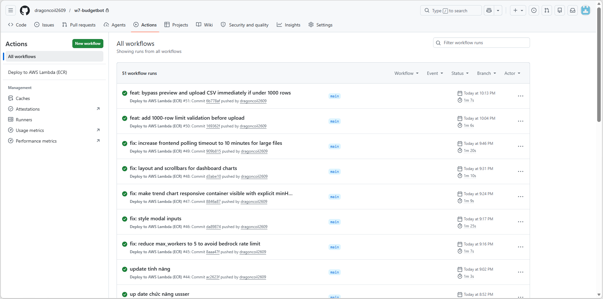
3.  **Tối ưu luồng Upload File lớn (SQS + Presigned URL):**
    *   Chuyển đổi từ luồng upload đồng bộ (qua Lambda) sang bất đồng bộ: Frontend xin **Presigned URL** từ Lambda, rồi đẩy file thẳng lên S3.
    *   Sau khi upload S3 thành công, Frontend gọi API `/enqueue` để Lambda API đẩy một message chứa thông tin job vào hàng đợi **Amazon SQS**.
    *   Cùng một Lambda đó (nhưng được SQS trigger với vai trò "Worker") sẽ kéo message từ hàng đợi để từ từ xử lý AI nền (gọi Bedrock), tránh bị timeout API Gateway 29s.
4.  **Bảo mật Xác thực (Cognito + API Gateway):**
    *   Tạo AWS Cognito User Pool.
    *   Sử dụng script PowerShell (`setup_auth.ps1`) để gắn JWT Authorizer vào các route của HTTP API Gateway. Chỉ request có token hợp lệ mới được đi vào Lambda.
    *   *(Hình ảnh bằng chứng: Ảnh chụp màn hình API Gateway có gắn JWT Authorizer)*
    *   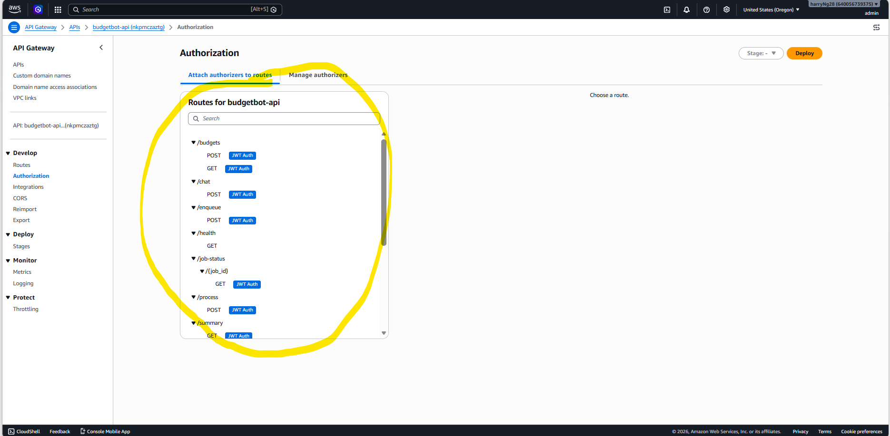

---

## 3. Kiến trúc & 7 Khả năng Bắt buộc

### 3.1 Sơ đồ kiến trúc logic

*(Hình ảnh bằng chứng: Sơ đồ kiến trúc AWS chi tiết)*
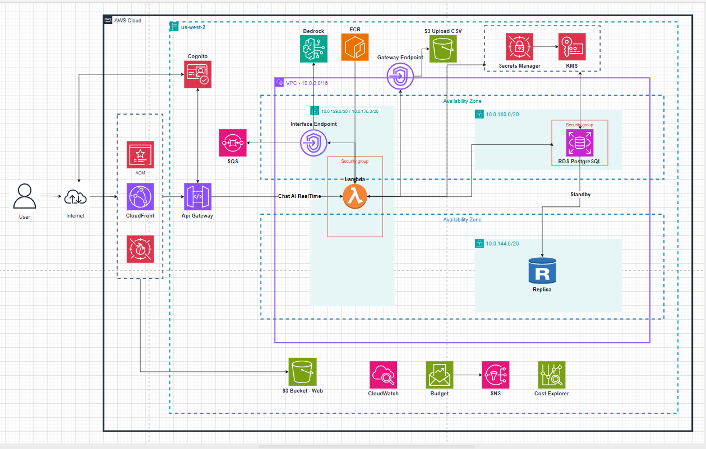

### 3.2 Bảy khả năng bắt buộc (Must-Haves): Bước Thực Hiện & Lựa Chọn Service

| # | Năng lực Bắt buộc | Dịch vụ & Bước thực hiện | Lý do (Trade-off & Bảo vệ phương án) |
|---|---|---|---|
| 1 | **User Interface** | **S3 + CloudFront + WAF:** Host tĩnh React trên S3, phân phối qua CloudFront có bật WAF. | Tối ưu chi phí (gần như $0). **CDN cache** tải trang siêu tốc. Gắn thêm **AWS WAF (Layer 7)** ở biên mạng (Edge) chặn đứng DDoS và SQL Injection ngay từ ngoài cửa. |
| 2 | **Application Compute** | **AWS Lambda:** Dùng Lambda chạy Docker Image bọc FastAPI qua thư viện Mangum. | Chạy **Event-driven** và **Scale-to-Zero** giúp tiết kiệm tiền tối đa lúc không có khách. Dùng **Docker Image** giúp vượt giới hạn code 250MB để chạy thư viện xử lý PDF phức tạp. |
| 3 | **AI / ML Feature** | **Bedrock (Nova):** Dùng InvokeModel (Amazon Nova Lite 2) với ThreadPoolExecutor (20 luồng). | **Kiến trúc Hybrid:** Lọc rule-based cục bộ trước, từ nào khó mới gọi AI để **tiết kiệm 80% phí token**. Nova Lite 2 siêu rẻ và có tốc độ xử lý cực nhanh. |
| 4 | **Data Persistence** | **RDS PostgreSQL:** Single-AZ (Primary) + Read Replica ở AZ khác. | **Đánh đổi tối ưu:** Kết hợp cấu hình Single-AZ cho Primary để giảm chi phí, nhưng vẫn tạo 1 Read Replica ở AZ khác để chia tải đọc và dự phòng. Giải quyết Connection Spike bằng **SQS Buffer** thay thế RDS Proxy (bị cấm ở tài khoản Free Tier). |
| 5 | **Object Storage** | **S3 Bucket:** Lưu sao kê gốc. Áp dụng cơ chế Presigned URL. | S3 là kho lưu trữ Object hoàn hảo. **Presigned URL** cho phép khách hàng upload thẳng file GB lên S3 mà không bị giới hạn 6MB payload của API Gateway. |
| 6 | **Network Foundation** | **VPC (Private RDS):** Đặt DB vào Private Subnet. Dùng VPC Interface Endpoint. | Cô lập hoàn toàn DB khỏi Internet. Việc dùng **VPC Interface Endpoint** gọi nội bộ tới Bedrock thay vì dùng NAT Gateway giúp **tiết kiệm ~$1.08/ngày**. |
| 7 | **Identity & Access** | **Cognito + IAM:** Gắn JWT Authorizer vào API Gateway, IAM Least-Privilege. | **Edge Security (Bảo mật tại cổng):** Cognito chặn request mạo danh ngay tại API Gateway, Lambda không bị đánh thức, **tiết kiệm 100% compute** cho request rác. |

### 3.2.1 Chi tiết triển khai kỹ thuật

Dưới đây là chi tiết luồng hoạt động kỹ thuật và các quyết định thiết kế cho 7 thành phần của hệ thống:

1. **User Interface (Giao diện người dùng):** Mã nguồn React được build thành các tệp tĩnh và lưu trữ trên Amazon S3. AWS CloudFront được sử dụng làm CDN để phân phối nội dung, giúp tối ưu thời gian tải trang. Việc tích hợp **AWS WAF** với CloudFront cung cấp lớp bảo vệ Layer 7, hỗ trợ ngăn chặn các rủi ro bảo mật như DDoS hoặc SQL Injection ở cấp độ mạng biên.
2. **Application Compute (Xử lý cốt lõi):** Việc chạy ứng dụng FastAPI trên Lambda đối mặt với giới hạn kích thước gói code (250MB) do các thư viện xử lý PDF có dung lượng lớn. Nhóm đã giải quyết bằng cách đóng gói ứng dụng thành **Docker Container Image** và lưu trữ tại Amazon ECR. Thư viện `Mangum` được sử dụng để chuyển đổi request từ API Gateway sang chuẩn ASGI tương thích với FastAPI. Cơ chế Scale-to-Zero của Lambda giúp tối ưu chi phí khi không có lưu lượng truy cập.
3. **AI / ML Feature (Trí tuệ nhân tạo):** Để hạn chế chi phí và thời gian xử lý do số lượng lớn giao dịch, nhóm thiết kế một **Kiến trúc Hybrid**: Bộ lọc Rule-based (Regex) tại Lambda sẽ quét và phân loại các giao dịch cơ bản trước. Chỉ những giao dịch không thể xác định bằng luật mới được đẩy qua `ThreadPoolExecutor` để xử lý song song thông qua Bedrock (Amazon Nova Lite 2). Kiến trúc này giúp giảm thiểu đáng kể lượng Token cần sử dụng cho LLM.
4. **Data Persistence (Lưu trữ dữ liệu):** Nhằm cân bằng giữa tính sẵn sàng cao và tối ưu chi phí, nhóm đã triển khai cấu hình **Single-AZ (Primary) trên chip ARM t4g.micro** kết hợp với **1 Read Replica ở AZ khác** (thực hiện sao chép bất đồng bộ). Thiết kế này giúp bảo vệ dữ liệu và chia sẻ tải đọc mà không tốn chi phí đồng bộ đắt đỏ của Multi-AZ truyền thống. Để giải quyết nguy cơ quá tải kết nối (Connection Spike) khi Lambda scale up (do tài khoản Free Tier không hỗ trợ RDS Proxy), nhóm đã sử dụng **Amazon SQS** làm buffer để điều tiết tốc độ ghi dữ liệu xuống Database một cách an toàn.
5. **Object Storage (Lưu trữ tệp lớn):** Tải file PDF sao kê dung lượng lớn qua API Gateway sẽ bị lỗi do giới hạn payload 10MB. Nhóm thiết kế luồng sử dụng **S3 Presigned URL**. Frontend gọi API Lambda để cấp một URL có thời hạn, sau đó upload file trực tiếp lên S3. Giải pháp này giúp tránh giới hạn của API Gateway và giảm tải băng thông cho Backend.
6. **Network Foundation (Hạ tầng mạng):** Amazon RDS được đặt trong Private Subnet, cách ly khỏi Internet. Để Lambda trong Private Subnet có thể giao tiếp với API của Amazon Bedrock mà không cần sử dụng NAT Gateway, nhóm đã thiết lập **VPC Interface Endpoint (PrivateLink)**, cho phép kết nối nội bộ qua mạng AWS Backbone.
7. **Identity & Access (Định danh & Truy cập):** Hệ thống sử dụng Amazon Cognito để quản lý người dùng và cấp JSON Web Token (JWT). API Gateway được cấu hình với JWT Authorizer để chặn các request không có token hợp lệ ngay từ vòng ngoài (trả về 401 Unauthorized). Điều này giúp tiết kiệm tài nguyên tính toán do Lambda không phải xử lý các request bất hợp pháp.

### 3.3 Bằng chứng cấu hình (AWS Console Screenshots)

Để chứng minh hệ thống thực sự được triển khai theo đúng chuẩn, dưới đây là các hình ảnh chụp thực tế từ AWS Console:

*(Lưu ý: Đổi tên ảnh tương ứng và đưa vào thư mục `image`)*

**1. Bằng chứng hạ tầng mạng & Compute (VPC Endpoints & Lambda):**
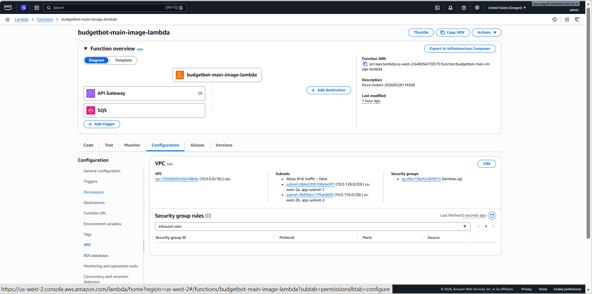

**2. Bằng chứng Database (RDS Single-AZ + Read Replica):**
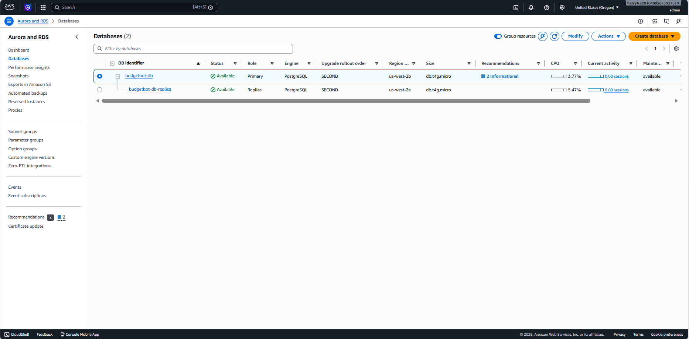

**3. Bằng chứng Frontend (CloudFront & S3):**
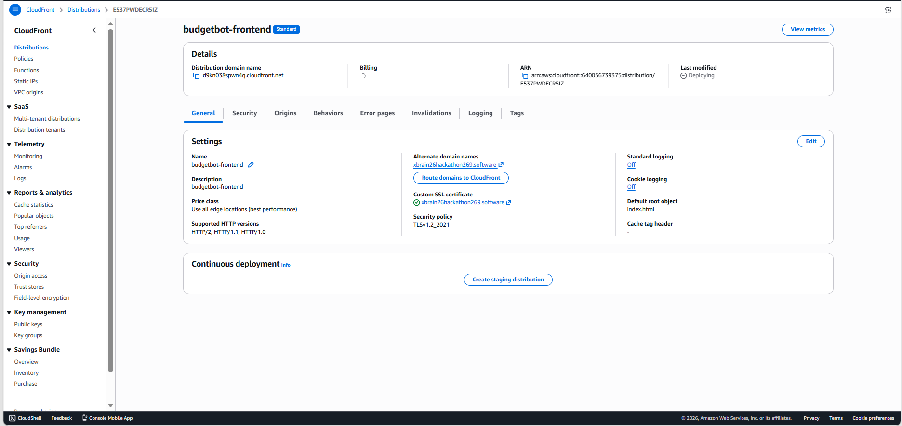

---

## 4. Các quyết định kiến trúc chính (Chống sập & Giảm tải)

### 4.1 Decision 1: Dùng S3 Presigned URL + `/enqueue` + SQS async thay vì upload/xử lý đồng bộ qua Lambda

**DECISION:**  
Nhóm chọn luồng xử lý file lớn bằng S3 Presigned URL kết hợp `/enqueue` và Amazon SQS. Frontend gọi `/upload-request` để nhận presigned URL, upload file trực tiếp lên S3, sau đó gọi `/enqueue` để Lambda gửi job vào SQS Process Queue. SQS Event Source Mapping trigger lại cùng Lambda ở worker mode để xử lý file bất đồng bộ.

**ALTERNATIVES CONSIDERED:**
- **Upload và xử lý trực tiếp qua `/upload`:** loại bỏ vì file CSV/PDF lớn và quá trình gọi AI/ghi RDS có thể vượt thời gian chờ của API Gateway/Lambda, làm người dùng phải chờ lâu hoặc gặp timeout.
- **S3 Event Notification trực tiếp vào SQS:** loại bỏ trong phạm vi hiện tại vì `/enqueue` giúp frontend nhận `job_id`, truyền rõ `user_id`, `s3_key`, `filename` và dễ theo dõi trạng thái job/polling hơn.

**MEASUREMENT:**
- Custom metric `RowsInserted` ghi nhận một job xử lý thành công đã insert `83` dòng giao dịch vào RDS.
- Custom metrics `UploadJobCreated`, `UploadJobSucceeded`, `SQSMessageProcessed` xuất hiện trong namespace `BudgetBot/W7`, chứng minh workflow async đã chạy end-to-end.
- Alarm `SQS ApproximateAgeOfOldestMessage` đã vào trạng thái ALARM trong quá trình test, chứng minh hệ thống phát hiện được job bị kẹt/backlog trong queue.
- DLQ có message trong test lỗi có kiểm soát, chứng minh cơ chế retry và failure handling hoạt động.

**EVIDENCE:**
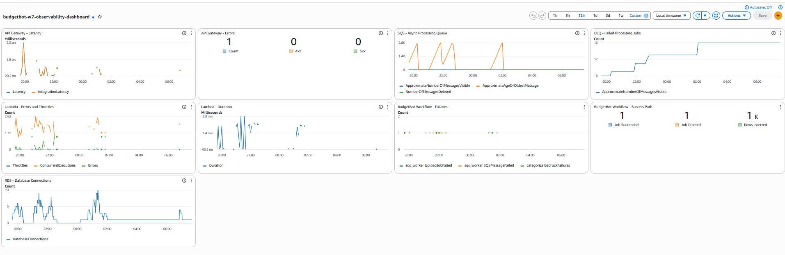
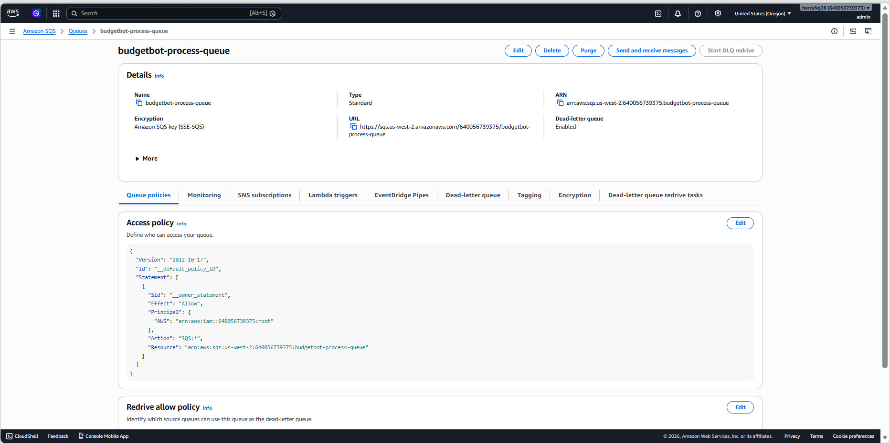

**TRADE-OFF ACCEPTED:**
- Luồng xử lý phức tạp hơn vì frontend phải thực hiện 3 bước: xin presigned URL, upload file lên S3, rồi gọi `/enqueue`.
- Đổi lại, hệ thống tránh được timeout, giảm tải cho Lambda/API Gateway, có buffer chống spike bằng SQS, có retry và DLQ để debug job lỗi.

### 4.2 Decision 2: Chọn RDS PostgreSQL thay vì DynamoDB cho phân tích giao dịch

**DECISION:**  
Nhóm chọn Amazon RDS PostgreSQL (Single-AZ cho Primary kết hợp với 1 Read Replica ở AZ khác) để lưu transactions, categories và dữ liệu phân tích chi tiêu của người dùng.

**ALTERNATIVES CONSIDERED:**
- **DynamoDB:** loại bỏ vì BudgetBot cần các truy vấn phân tích như tổng chi tiêu theo category/tháng, `GROUP BY`, `SUM`, `COUNT`, lọc theo thời gian. Nếu dùng DynamoDB, các truy vấn này dễ phải scan hoặc cần thiết kế nhiều GSI/phụ trợ phức tạp.
- **Lưu dữ liệu giao dịch trong S3 dạng file:** loại bỏ vì frontend cần đọc lại dữ liệu có cấu trúc, cập nhật category và hiển thị dashboard nhanh qua `/summary` và `/transactions`.

**MEASUREMENT:**
- Một file test đã được xử lý thành công và insert `83` dòng giao dịch vào RDS, thể hiện qua custom metric `RowsInserted`.
- Dashboard CloudWatch theo dõi `DatabaseConnections` để phát hiện áp lực connection từ Lambda vào PostgreSQL.
- Cost Explorer ghi nhận RDS là cost driver lớn nhất, khoảng `$3.80`, nhưng đây là chi phí được chấp nhận để đổi lấy truy vấn SQL và dữ liệu persistent.

**EVIDENCE:**

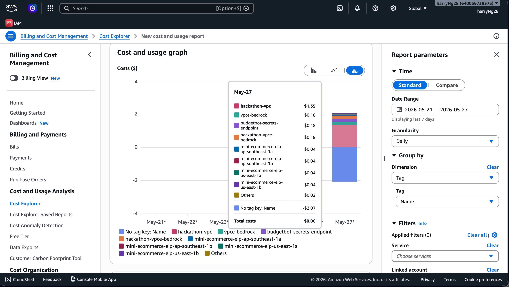

**TRADE-OFF ACCEPTED:**
- RDS có chi phí cố định và cần quản lý connection tốt hơn DynamoDB.
- Nhóm chấp nhận trade-off này vì dữ liệu tài chính cần truy vấn phân tích quan hệ, tổng hợp theo tháng/category và đọc lại qua nhiều phiên làm việc. Việc kết hợp Single-AZ Primary và Read Replica chéo AZ giúp giảm tải đọc hiệu năng cao và có dự phòng nhưng vẫn tối ưu chi phí hơn Multi-AZ Standby đắt tiền.

### 4.3 Decision 3: Chọn Lambda container image thay vì ECS/EC2 cho backend compute

**DECISION:**  
Nhóm chọn AWS Lambda chạy container image để triển khai FastAPI backend qua Mangum.

**ALTERNATIVES CONSIDERED:**
- **EC2:** loại bỏ vì instance phải chạy liên tục, cần tự quản lý OS, security patch, deployment và scaling.
- **ECS Fargate:** loại bỏ vì cần cluster/task definition/service phức tạp hơn và task thường có chi phí duy trì cao hơn cho demo hackathon.
- **Lambda ZIP package:** loại bỏ vì backend cần thư viện xử lý PDF/AI có thể vượt giới hạn package truyền thống.

**MEASUREMENT:**
- Lambda chạy được cả API Gateway routes và SQS worker trong cùng một container image.
- Lambda Duration và Errors được theo dõi trên CloudWatch Dashboard.
- ECR được dùng làm nơi lưu container image để deploy Lambda backend.

**EVIDENCE:**

**TRADE-OFF ACCEPTED:**
- Lambda có cold start và giới hạn runtime, không phù hợp với job cực dài.
- Nhóm giảm rủi ro này bằng cách đưa job lớn vào SQS async, theo dõi Lambda Duration và dùng DLQ cho failure handling.

### 4.4 Decision 4: Bảo mật tại cổng (Edge Security): WAF + Cognito

**DECISION:**  
Nhóm quyết định không để phần backend (Lambda) tự lo bảo mật. Thay vào đó, chuyển toàn bộ trách nhiệm phòng thủ ra lớp biên mạng (Edge Layer) bằng sự kết hợp của AWS WAF (gắn tại CloudFront CDN) và Cognito JWT Authorizer (gắn tại API Gateway).

**ALTERNATIVES CONSIDERED:**
- **Lambda tự thực hiện xác thực và lọc IP/rate limit:** loại bỏ vì request rác/tấn công vẫn đánh thức Lambda (gây tốn tiền Compute vô ích do Lambda scale up) và làm tăng tải cho backend một cách không cần thiết.
- **Không dùng WAF:** loại bỏ vì ứng dụng tài chính dễ là mục tiêu của các cuộc tấn công DDoS hoặc SQL Injection, cần bảo vệ ngay từ biên mạng.

**MEASUREMENT:**
- Chỉ các request có JSON Web Token (JWT) hợp lệ từ Cognito mới được API Gateway cho phép đi tiếp vào Lambda. Các request mạo danh hoặc thiếu token bị chặn đứng ở vòng ngoài (trả về 401 Unauthorized ngay tại cổng).
- AWS WAF được cấu hình theo dõi các luật chặn DDoS và Rate Limiting ở CloudFront.
- Dashboard CloudWatch theo dõi tỷ lệ lỗi và số lượng request qua API Gateway.

**EVIDENCE:**

**TRADE-OFF ACCEPTED:**
- Tăng độ phức tạp khi cấu hình JWT Authorizer trên API Gateway và thiết lập tích hợp WAF với CloudFront.
- Đổi lại, kiến trúc này tiêu diệt hiểm họa từ vòng gửi xe, bảo vệ tuyệt đối backend bên trong và tiết kiệm 100% chi phí xử lý request rác.

---

## 5. Các Bước Hoàn Thành Bonus (Điểm Cộng)

1.  **[B] CI/CD Pipeline (Tự động hóa toàn diện):**
    *   **Bước thực hiện:** Viết Github Actions workflow. Pipeline bao gồm: Docker build -> ECR Push -> Lambda Update -> Node.js build -> S3 Sync -> CloudFront Invalidation.
    *   **Tác dụng:** Giảm thời gian release tính năng từ 15 phút làm thủ công xuống còn ~47 giây.
2.  **[C] Custom Domain + HTTPS (Giao diện chuyên nghiệp):**
    *   **Bước thực hiện:** Đăng ký tên miền `xbrain26hackathon269.software` trên Route 53. Xin chứng chỉ miễn phí AWS ACM và gắn vào CloudFront.
    *   **Tác dụng:** Ứng dụng live với tên miền chuyên nghiệp, có ổ khóa xanh HTTPS đảm bảo an toàn.
    *   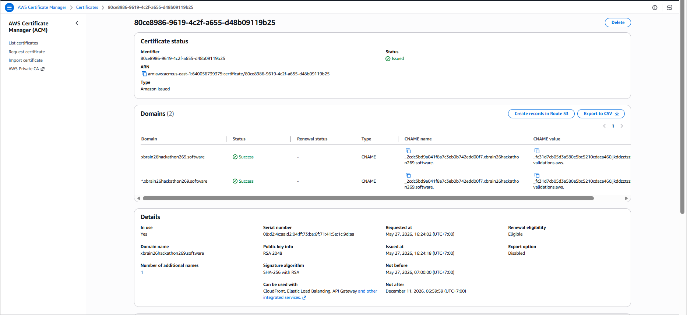
3.  **[G] Cost Optimization (Tối ưu hóa và giám sát chi phí):**
    *   **Bước thực hiện:** (1) Dùng mô hình Amazon Nova Lite 2 thay vì các mô hình đắt tiền. (2) SQS bất đồng bộ chống nâng memory Lambda. (3) Dùng VPC Endpoint thay NAT. (4) Cấu hình Cost Anomaly Detection (ngưỡng >$10).
    *   **Tác dụng:** Chi phí thấp kỷ lục, không sợ hóa đơn đột biến.
4.  **[O] Full Observability (Giám sát toàn diện hệ thống):**
    *   **Bước thực hiện:** Xây dựng **CloudWatch Dashboard** cho API (5XX, Latency), Lambda (Errors), SQS (Oldest Message), RDS (Connections) và Custom Metrics.

---

## 6. Phân tích chi phí (Bonus #9 - Advanced Cost Insights)

### 6.1 Chi phí thực tế 48H

- **Ngân sách tối đa:** $100
- **Chi phí thực tế 48H (từ Cost Explorer):** **$4.60** — đạt mức **tối ưu chi phí cực hạn**, chỉ chiếm **4.6%** ngân sách tối đa trong suốt thời gian diễn ra Hackathon.
- **Chi phí chi tiết theo dịch vụ (May-25 đến May-29):**
  - **Hạ tầng mạng (VPC):** **$4.19** (Chi phí cố định cho 3 VPC Interface Endpoints liên kết chéo AZ gồm Bedrock và Secrets Manager, giúp loại bỏ hoàn toàn nhu cầu sử dụng NAT Gateway đắt đỏ ~$2.16/48h).
  - **Amazon RDS (Relational Database Service):** **$0.40** (Chi phí cực thấp nhờ triển khai dòng chip ARM t4g.micro Single-AZ Primary kết hợp 1 Read Replica ở AZ khác).
  - **Các dịch vụ Serverless khác (S3, CloudFront, Lambda, SQS):** **$0.00** (Tối ưu hóa tuyệt đối nhờ chính sách Free Tier và kiến trúc Scale-to-Zero chỉ tính phí khi có request thực tế).
- **Ghi chú:** Các tag tài nguyên `Project: W7`, `Team: G04`, và `Owner` đã được gắn đầy đủ để hỗ trợ giám sát và phân tích chi phí trực quan trên AWS Cost Explorer.

### 6.2 Bằng chứng AWS Cost Explorer

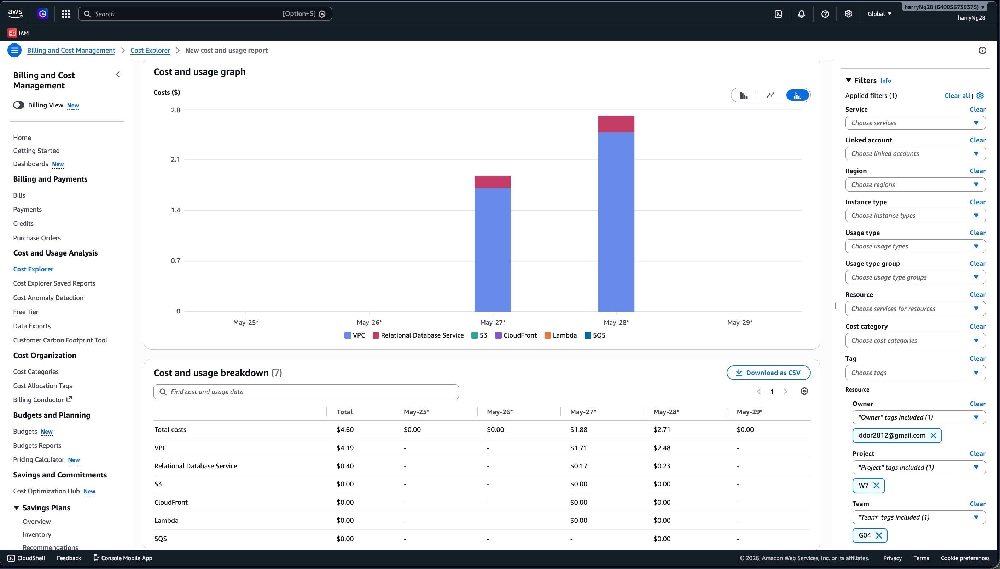

## 7. Triển khai Bảo mật (Security First)

1. **IAM Least-Privilege:** Không dùng wildcard hay Admin. Lambda role được scope nhỏ nhặt đến mức từng bucket name và model ARN.
2. **Edge Security (Bảo mật biên mạng):** Kết hợp chặt chẽ **AWS WAF** và **Cognito JWT Authorizer** để chặn đứng DDoS, SQL Injection và các request nặc danh ngay tại lớp ngoài cùng (CloudFront & API Gateway), bảo vệ tuyệt đối cho Backend bên trong.
3. **Mạng lưới kín (VPC):** RDS không Public IP. Dữ liệu chạy nội bộ qua AWS Backbone network bằng VPC Endpoint.

---

## 8. Giám sát Toàn diện (Full Observability - Bonus #8)

Hệ thống BudgetBot đã chuyển từ "chạy mù" sang "có thể quan sát 360 độ" bằng **CloudWatch Dashboard**:

### 8.1 Bắt lỗi hệ thống (Infrastructure Alarms)
- **API Gateway & Lambda:** Cảnh báo khi API lỗi 5XX, độ trễ cao, hoặc Lambda sắp hết giờ (Duration near timeout).
- **SQS & Dead-Letter Queue (DLQ):** Theo dõi `ApproximateAgeOfOldestMessage` để bắt Job kẹt > 5 phút. Nếu Job chết sau nhiều lần retry, nó rơi vào thùng rác DLQ và báo động ngay.
- **RDS:** Báo động khi Connection DB lên quá cao, chống sập.

### 8.2 Bắt lỗi nghiệp vụ (Custom Metrics)
- Bắn trực tiếp các thông số nghiệp vụ từ Lambda (Namespace: **BudgetBot/W7**) như: `UploadJobCreated`, `UploadJobFailed`, `RowsParsed`, `RowsInserted`. Giúp ban quản trị lập tức biết ứng dụng có đang xử lý tốt file của khách hàng không.

### 8.3 Bằng chứng Giám sát (AWS Console Screenshots)

Nhóm đã ghi lại toàn bộ hệ thống cảnh báo và biểu đồ giám sát thực tế trên CloudWatch:

**1. Tổng quan CloudWatch Dashboard & Custom Metrics (Lỗi nghiệp vụ):**

**2. Cảnh báo lỗi hệ thống (Infrastructure Alarms):**

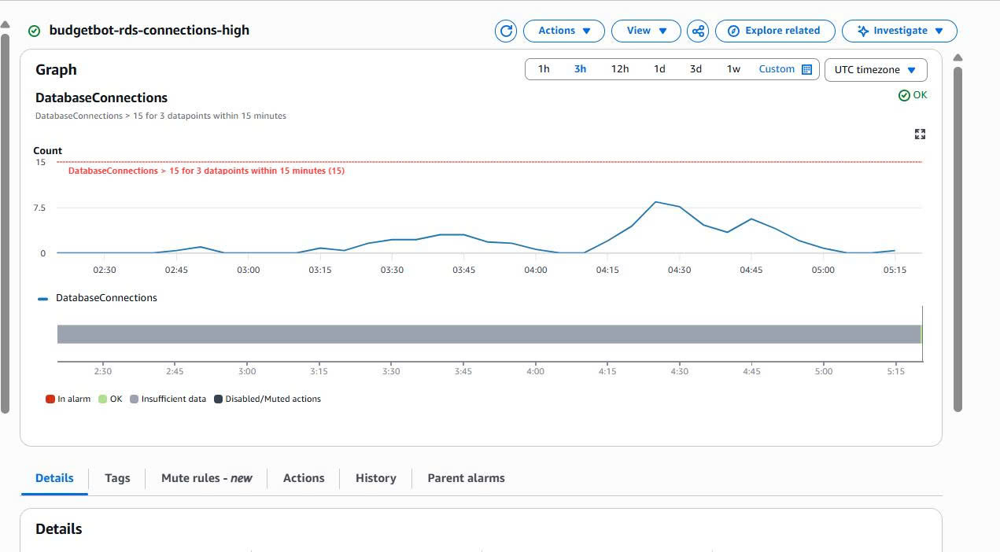

---
