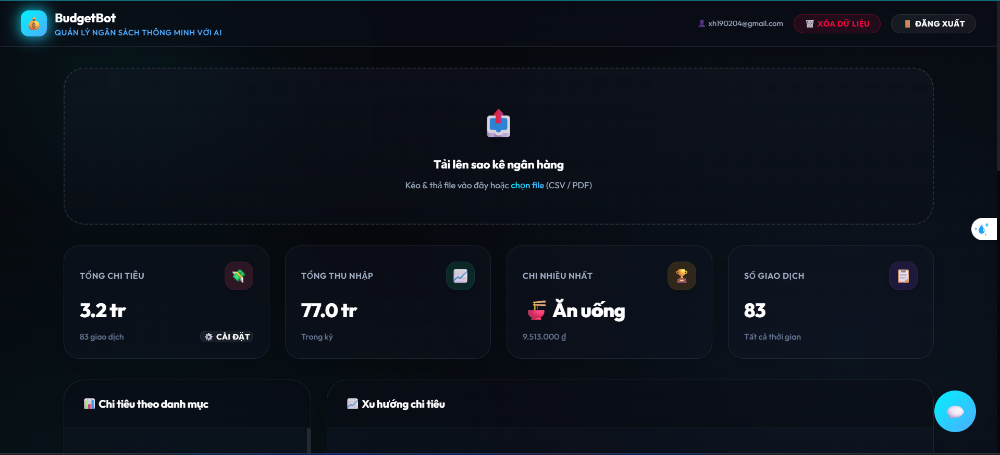
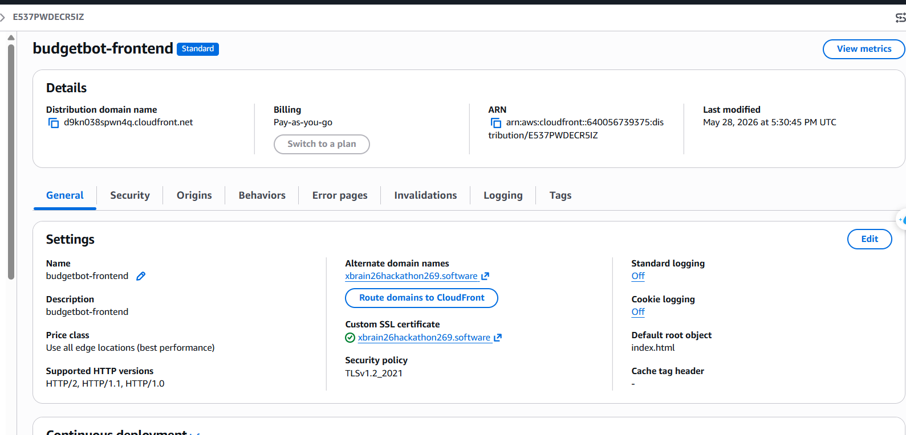
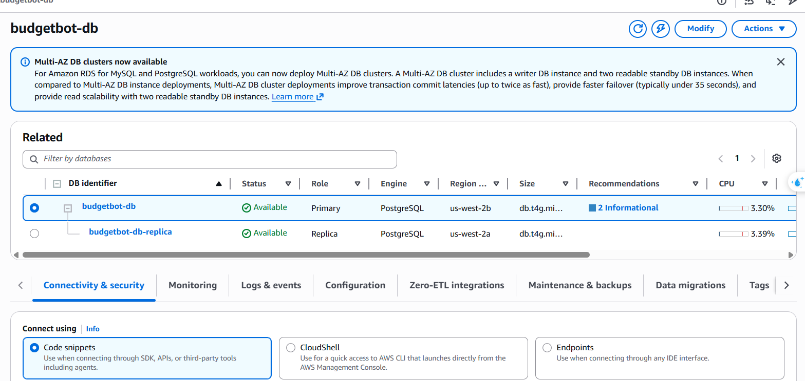
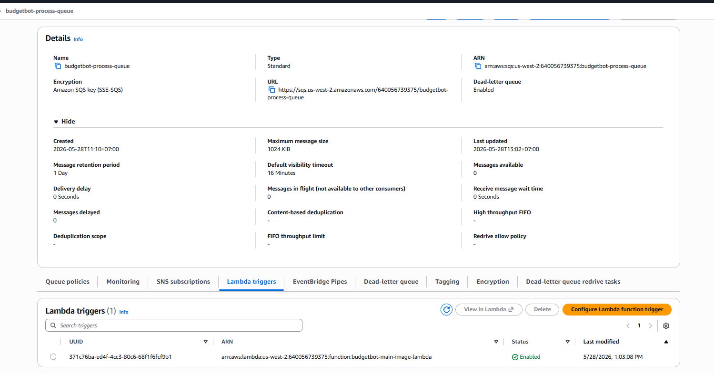
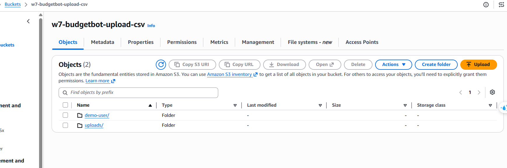
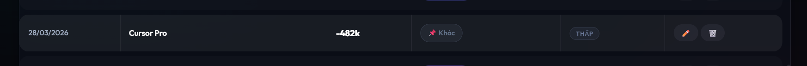
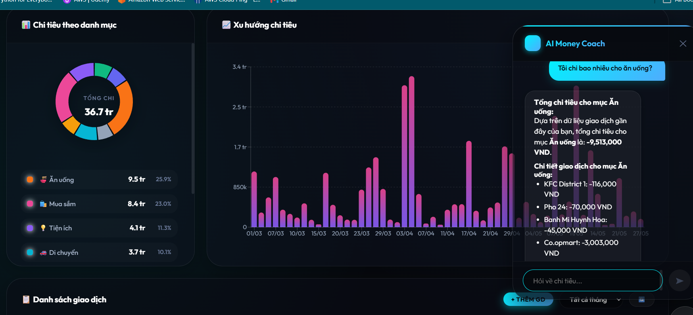
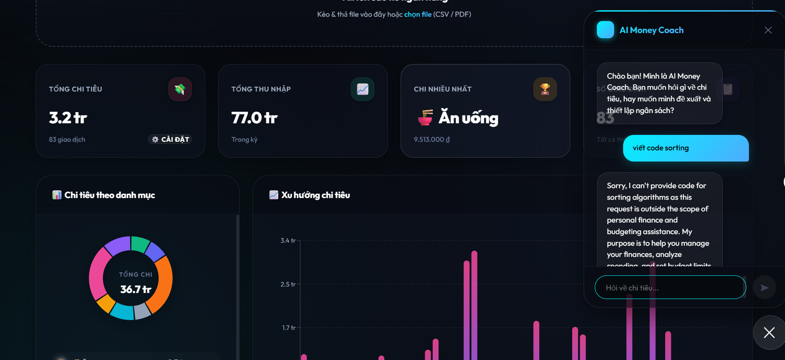
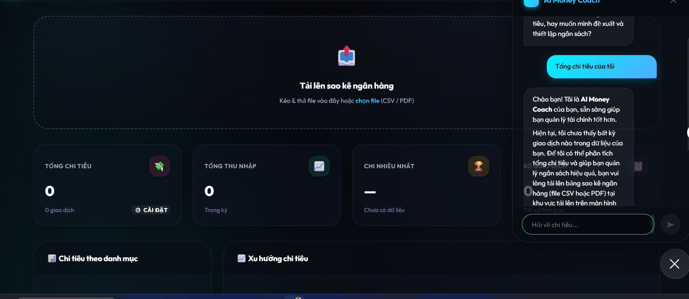
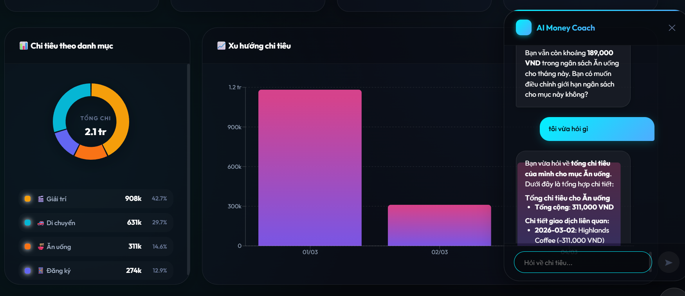

# W7 Evidence Pack — BudgetBot (FinTech: AI Money Coach)

**Nhóm:** G4

**Thành viên:**
- Ngô Nguyễn Trường An (ngonguyentruongan2907@gmail.com)
- Phạm Hữu Tiến Thành (tienthanh711204@gmail.com)
- Nguyễn Huy Hoàng (nguyenvanhuyhoang2609@gmail.com)
- Nguyễn Phú Tài (ddor2812@gmail.com)
- Cái Xuân Hoà (xuanhoa2004tt@gmail.com)
- Phan Hoàng Nhật (nhatphanhk102@gmail.com)

**Live URL:** https://xbrain26hackathon269.software/
**Repo link:** https://github.com/dragoncoil2609/w7-budgetbot.git
**Domain choice:** Domain B — FinTech: "AI Money Coach"
**Total spend:**

---

## 1. Lĩnh vực & Use Case

### 1.1 Vấn đề cần giải quyết
Sao kê ngân hàng đã mã hóa và nằm rải rác trên nhiều định dạng (PDF, CSV). Người dùng gặp khó khăn trong:
- Phân loại giao dịch thủ công (tốn thời gian, dễ sai)
- Hiểu được mô hình chi tiêu qua các tháng
- Lập và theo dõi mục tiêu ngân sách
- Trả lời "Tiền của tôi đã đi đâu?" mà không cần đối chiếu thủ công

### 1.2 Giải pháp — BudgetBot
**Tagline:** Tải lên sao kê của bạn. Hiểu chính xác tiền của bạn đã đi đâu.

**Quy trình người dùng cơ bản:**
1. Người dùng đăng nhập qua Cognito → lấy Token truy cập hệ thống.
2. Tải lên sao kê (PDF hoặc CSV) qua S3 Presigned URL.
3. Backend phân tích sao kê (xử lý bất đồng bộ qua SQS) → AI phân loại từng giao dịch.
4. Dashboard hiển thị phân tích, theo dõi ngân sách, xu hướng chi tiêu.

### 1.3 Lý do lựa chọn use case (Phân tích kỹ thuật)
- **Bài toán Data Pipeline điển hình:** Luồng xử lý trích xuất dữ liệu thô từ file (S3) → phân loại bằng AI (Lambda + Bedrock) → lưu trữ có cấu trúc (RDS) là một kiến trúc chuẩn trong lĩnh vực xử lý dữ liệu, cho phép nhóm triển khai và tích hợp đồng thời nhiều dịch vụ cốt lõi của AWS.
- **Đặc thù tải bùng phát (Burst Traffic) phù hợp với Serverless:** Hành vi người dùng cuối tháng thường tải lên sao kê đồng loạt, tạo ra mô hình traffic dạng spike. Đặc điểm này cho phép nhóm khai thác tối đa lợi thế Scale-to-Zero của Lambda (tối ưu chi phí khi rảnh) và cơ chế điều tiết tải bằng SQS (Anti-Spike) khi tải cao.
- **Dữ liệu phi cấu trúc phù hợp với AI:** Sao kê ngân hàng tại Việt Nam thường không theo chuẩn thống nhất về định dạng và từ viết tắt. Việc áp dụng LLM (**Amazon Nova Lite 2** qua Bedrock) để phân loại tự động thay thế cho phương pháp Regex cứng nhắc là minh chứng cho ứng dụng AI thực tế trong bài toán xử lý dữ liệu tài chính.

---

## 2. Các Bước Triển Khai Dự Án (Deployment Pipeline)

Dự án BudgetBot được triển khai theo 4 bước kiến trúc lớn để từ một MVP trở thành "Production-Ready":

1.  **Thiết lập Hạ tầng Cơ sở (Infrastructure Base):**
    *   **Mạng & Database:** Tạo VPC, thiết lập Private Subnet cho Database (Amazon RDS PostgreSQL) để đảm bảo cô lập mạng.
    *   **Backend Compute:** Khởi tạo kho lưu trữ Amazon ECR (để chứa Docker Image của code Python) và cấu hình AWS Lambda chạy Container Image. Thiết lập HTTP API Gateway làm cổng giao tiếp.
    *   **Frontend & Storage:** Tạo S3 Bucket cho Frontend, S3 Bucket cho upload sao kê gốc, và cấu hình CloudFront CDN để phân phối HTTPS.
2.  **Tự động hóa CI/CD Pipeline:**
    *   Thiết lập GitHub Actions. Mỗi khi code được push lên nhánh `main`:
        *   Frontend: Tự động build React (Vite) và sync lên S3, clear cache CloudFront.
        *   Backend: Build Docker Image, đẩy lên Amazon ECR, và cập nhật code cho AWS Lambda.
    *   *(Hình ảnh bằng chứng: Ảnh chụp màn hình GitHub Actions báo Xanh/Success)*
    *   
3.  **Tối ưu luồng Upload File lớn (SQS + Presigned URL):**
    *   Chuyển đổi từ luồng upload đồng bộ (qua Lambda) sang bất đồng bộ: Frontend xin **Presigned URL** từ Lambda, rồi đẩy file thẳng lên S3.
    *   Sau khi upload S3 thành công, Frontend gọi API `/enqueue` để Lambda API đẩy một message chứa thông tin job vào hàng đợi **Amazon SQS**.
    *   Cùng một Lambda đó (nhưng được SQS trigger với vai trò "Worker") sẽ kéo message từ hàng đợi để từ từ xử lý AI nền (gọi Bedrock), tránh bị timeout API Gateway 29s.
4.  **Bảo mật Xác thực (Cognito + API Gateway):**
    *   Tạo AWS Cognito User Pool.
    *   Sử dụng script PowerShell (`setup_auth.ps1`) để gắn JWT Authorizer vào các route của HTTP API Gateway. Chỉ request có token hợp lệ mới được đi vào Lambda.
    *   *(Hình ảnh bằng chứng: Ảnh chụp màn hình API Gateway có gắn JWT Authorizer)*
    *   

---

## 3. Kiến trúc & 7 Khả năng Bắt buộc

### 3.1 Sơ đồ kiến trúc logic

*(Hình ảnh bằng chứng: Sơ đồ kiến trúc AWS chi tiết)*


### 3.2 Bảy khả năng bắt buộc (Must-Haves): Bước Thực Hiện & Lựa Chọn Service

| # | Năng lực Bắt buộc | Dịch vụ & Bước thực hiện | Lý do (Trade-off & Bảo vệ phương án) |
|---|---|---|---|
| 1 | **User Interface** | **S3 + CloudFront + WAF:** Host tĩnh React trên S3, phân phối qua CloudFront có bật WAF. | Tối ưu chi phí (gần như $0). **CDN cache** tải trang siêu tốc. Gắn thêm **AWS WAF (Layer 7)** ở biên mạng (Edge) chặn đứng DDoS và SQL Injection ngay từ ngoài cửa. |
| 2 | **Application Compute** | **AWS Lambda:** Dùng Lambda chạy Docker Image bọc FastAPI qua thư viện Mangum. | Chạy **Event-driven** và **Scale-to-Zero** giúp tiết kiệm tiền tối đa lúc không có khách. Dùng **Docker Image** giúp vượt giới hạn code 250MB để chạy thư viện xử lý PDF phức tạp. |
| 3 | **AI / ML Feature** | **Bedrock (Nova):** Dùng InvokeModel (Amazon Nova Lite 2) với ThreadPoolExecutor (20 luồng). | **Kiến trúc Hybrid:** Lọc rule-based cục bộ trước, từ nào khó mới gọi AI để **tiết kiệm 80% phí token**. Nova Lite 2 siêu rẻ và có tốc độ xử lý cực nhanh. |
| 4 | **Data Persistence** | **RDS PostgreSQL:** Single-AZ (Primary) + Read Replica ở AZ khác. | **Đánh đổi tối ưu:** Kết hợp cấu hình Single-AZ cho Primary để giảm chi phí, nhưng vẫn tạo 1 Read Replica ở AZ khác để chia tải đọc và dự phòng. Giải quyết Connection Spike bằng **SQS Buffer** thay thế RDS Proxy (bị cấm ở tài khoản Free Tier). |
| 5 | **Object Storage** | **S3 Bucket:** Lưu sao kê gốc. Áp dụng cơ chế Presigned URL. | S3 là kho lưu trữ Object hoàn hảo. **Presigned URL** cho phép khách hàng upload thẳng file GB lên S3 mà không bị giới hạn 6MB payload của API Gateway. |
| 6 | **Network Foundation** | **VPC (Private RDS):** Đặt DB vào Private Subnet. Dùng VPC Interface Endpoint. | Cô lập hoàn toàn DB khỏi Internet. Việc dùng **VPC Interface Endpoint** gọi nội bộ tới Bedrock thay vì dùng NAT Gateway giúp **tiết kiệm ~$1.08/ngày**. |
| 7 | **Identity & Access** | **Cognito + IAM:** Gắn JWT Authorizer vào API Gateway, IAM Least-Privilege. | **Edge Security (Bảo mật tại cổng):** Cognito chặn request mạo danh ngay tại API Gateway, Lambda không bị đánh thức, **tiết kiệm 100% compute** cho request rác. |

### 3.2.1 Chi tiết triển khai kỹ thuật

Dưới đây là chi tiết luồng hoạt động kỹ thuật và các quyết định thiết kế cho 7 thành phần của hệ thống:

1. **User Interface (Giao diện người dùng):** Mã nguồn React được build thành các tệp tĩnh và lưu trữ trên Amazon S3. AWS CloudFront được sử dụng làm CDN để phân phối nội dung, giúp tối ưu thời gian tải trang. Việc tích hợp **AWS WAF** với CloudFront cung cấp lớp bảo vệ Layer 7, hỗ trợ ngăn chặn các rủi ro bảo mật như DDoS hoặc SQL Injection ở cấp độ mạng biên.
2. **Application Compute (Xử lý cốt lõi):** Việc chạy ứng dụng FastAPI trên Lambda đối mặt với giới hạn kích thước gói code (250MB) do các thư viện xử lý PDF có dung lượng lớn. Nhóm đã giải quyết bằng cách đóng gói ứng dụng thành **Docker Container Image** và lưu trữ tại Amazon ECR. Thư viện `Mangum` được sử dụng để chuyển đổi request từ API Gateway sang chuẩn ASGI tương thích với FastAPI. Cơ chế Scale-to-Zero của Lambda giúp tối ưu chi phí khi không có lưu lượng truy cập.
3. **AI / ML Feature (Trí tuệ nhân tạo):** Để hạn chế chi phí và thời gian xử lý do số lượng lớn giao dịch, nhóm thiết kế một **Kiến trúc Hybrid**: Bộ lọc Rule-based (Regex) tại Lambda sẽ quét và phân loại các giao dịch cơ bản trước. Chỉ những giao dịch không thể xác định bằng luật mới được đẩy qua `ThreadPoolExecutor` để xử lý song song thông qua Bedrock (Amazon Nova Lite 2). Kiến trúc này giúp giảm thiểu đáng kể lượng Token cần sử dụng cho LLM.
4. **Data Persistence (Lưu trữ dữ liệu):** Nhằm cân bằng giữa tính sẵn sàng cao và tối ưu chi phí, nhóm đã triển khai cấu hình **Single-AZ (Primary) trên chip ARM t4g.micro** kết hợp với **1 Read Replica ở AZ khác** (thực hiện sao chép bất đồng bộ). Thiết kế này giúp bảo vệ dữ liệu và chia sẻ tải đọc mà không tốn chi phí đồng bộ đắt đỏ của Multi-AZ truyền thống. Để giải quyết nguy cơ quá tải kết nối (Connection Spike) khi Lambda scale up (do tài khoản Free Tier không hỗ trợ RDS Proxy), nhóm đã sử dụng **Amazon SQS** làm buffer để điều tiết tốc độ ghi dữ liệu xuống Database một cách an toàn.
5. **Object Storage (Lưu trữ tệp lớn):** Tải file PDF sao kê dung lượng lớn qua API Gateway sẽ bị lỗi do giới hạn payload 10MB. Nhóm thiết kế luồng sử dụng **S3 Presigned URL**. Frontend gọi API Lambda để cấp một URL có thời hạn, sau đó upload file trực tiếp lên S3. Giải pháp này giúp tránh giới hạn của API Gateway và giảm tải băng thông cho Backend.
6. **Network Foundation (Hạ tầng mạng):** Amazon RDS được đặt trong Private Subnet, cách ly khỏi Internet. Để Lambda trong Private Subnet có thể giao tiếp với API của Amazon Bedrock mà không cần sử dụng NAT Gateway, nhóm đã thiết lập **VPC Interface Endpoint (PrivateLink)**, cho phép kết nối nội bộ qua mạng AWS Backbone.
7. **Identity & Access (Định danh & Truy cập):** Hệ thống sử dụng Amazon Cognito để quản lý người dùng và cấp JSON Web Token (JWT). API Gateway được cấu hình với JWT Authorizer để chặn các request không có token hợp lệ ngay từ vòng ngoài (trả về 401 Unauthorized). Điều này giúp tiết kiệm tài nguyên tính toán do Lambda không phải xử lý các request bất hợp pháp.

### 3.3 Bằng chứng cấu hình (AWS Console Screenshots)

Để chứng minh hệ thống thực sự được triển khai theo đúng chuẩn, dưới đây là các hình ảnh chụp thực tế từ AWS Console:

*(Lưu ý: Đổi tên ảnh tương ứng và đưa vào thư mục `image`)*

**1. Bằng chứng hạ tầng mạng & Compute (VPC Endpoints & Lambda):**


**2. Bằng chứng Database (RDS Single-AZ + Read Replica):**


**3. Bằng chứng Frontend (CloudFront & S3):**


---

## 4. Các quyết định kiến trúc chính (Chống sập & Giảm tải)

### 4.1 Decision 1: Dùng S3 Presigned URL + `/enqueue` + SQS async thay vì upload/xử lý đồng bộ qua Lambda

**DECISION:**  
Nhóm chọn luồng xử lý file lớn bằng S3 Presigned URL kết hợp `/enqueue` và Amazon SQS. Frontend gọi `/upload-request` để nhận presigned URL, upload file trực tiếp lên S3, sau đó gọi `/enqueue` để Lambda gửi job vào SQS Process Queue. SQS Event Source Mapping trigger lại cùng Lambda ở worker mode để xử lý file bất đồng bộ.

**ALTERNATIVES CONSIDERED:**
- **Upload và xử lý trực tiếp qua `/upload`:** loại bỏ vì file CSV/PDF lớn và quá trình gọi AI/ghi RDS có thể vượt thời gian chờ của API Gateway/Lambda, làm người dùng phải chờ lâu hoặc gặp timeout.
- **S3 Event Notification trực tiếp vào SQS:** loại bỏ trong phạm vi hiện tại vì `/enqueue` giúp frontend nhận `job_id`, truyền rõ `user_id`, `s3_key`, `filename` và dễ theo dõi trạng thái job/polling hơn.

**MEASUREMENT:**
- Custom metric `RowsInserted` ghi nhận một job xử lý thành công đã insert `83` dòng giao dịch vào RDS.
- Custom metrics `UploadJobCreated`, `UploadJobSucceeded`, `SQSMessageProcessed` xuất hiện trong namespace `BudgetBot/W7`, chứng minh workflow async đã chạy end-to-end.
- Alarm `SQS ApproximateAgeOfOldestMessage` đã vào trạng thái ALARM trong quá trình test, chứng minh hệ thống phát hiện được job bị kẹt/backlog trong queue.
- DLQ có message trong test lỗi có kiểm soát, chứng minh cơ chế retry và failure handling hoạt động.

**EVIDENCE:**


**TRADE-OFF ACCEPTED:**
- Luồng xử lý phức tạp hơn vì frontend phải thực hiện 3 bước: xin presigned URL, upload file lên S3, rồi gọi `/enqueue`.
- Đổi lại, hệ thống tránh được timeout, giảm tải cho Lambda/API Gateway, có buffer chống spike bằng SQS, có retry và DLQ để debug job lỗi.

### 4.2 Decision 2: Chọn RDS PostgreSQL thay vì DynamoDB cho phân tích giao dịch

**DECISION:**  
Nhóm chọn Amazon RDS PostgreSQL (Single-AZ cho Primary kết hợp với 1 Read Replica ở AZ khác) để lưu transactions, categories và dữ liệu phân tích chi tiêu của người dùng.

**ALTERNATIVES CONSIDERED:**
- **DynamoDB:** loại bỏ vì BudgetBot cần các truy vấn phân tích như tổng chi tiêu theo category/tháng, `GROUP BY`, `SUM`, `COUNT`, lọc theo thời gian. Nếu dùng DynamoDB, các truy vấn này dễ phải scan hoặc cần thiết kế nhiều GSI/phụ trợ phức tạp.
- **Lưu dữ liệu giao dịch trong S3 dạng file:** loại bỏ vì frontend cần đọc lại dữ liệu có cấu trúc, cập nhật category và hiển thị dashboard nhanh qua `/summary` và `/transactions`.

**MEASUREMENT:**
- Một file test đã được xử lý thành công và insert `83` dòng giao dịch vào RDS, thể hiện qua custom metric `RowsInserted`.
- Dashboard CloudWatch theo dõi `DatabaseConnections` để phát hiện áp lực connection từ Lambda vào PostgreSQL.
- Cost Explorer ghi nhận RDS là cost driver lớn nhất, khoảng `$3.80`, nhưng đây là chi phí được chấp nhận để đổi lấy truy vấn SQL và dữ liệu persistent.

**EVIDENCE:**


**TRADE-OFF ACCEPTED:**
- RDS có chi phí cố định và cần quản lý connection tốt hơn DynamoDB.
- Nhóm chấp nhận trade-off này vì dữ liệu tài chính cần truy vấn phân tích quan hệ, tổng hợp theo tháng/category và đọc lại qua nhiều phiên làm việc. Việc kết hợp Single-AZ Primary và Read Replica chéo AZ giúp giảm tải đọc hiệu năng cao và có dự phòng nhưng vẫn tối ưu chi phí hơn Multi-AZ Standby đắt tiền.

### 4.3 Decision 3: Chọn Lambda container image thay vì ECS/EC2 cho backend compute

**DECISION:**  
Nhóm chọn AWS Lambda chạy container image để triển khai FastAPI backend qua Mangum.

**ALTERNATIVES CONSIDERED:**
- **EC2:** loại bỏ vì instance phải chạy liên tục, cần tự quản lý OS, security patch, deployment và scaling.
- **ECS Fargate:** loại bỏ vì cần cluster/task definition/service phức tạp hơn và task thường có chi phí duy trì cao hơn cho demo hackathon.
- **Lambda ZIP package:** loại bỏ vì backend cần thư viện xử lý PDF/AI có thể vượt giới hạn package truyền thống.

**MEASUREMENT:**
- Lambda chạy được cả API Gateway routes và SQS worker trong cùng một container image.
- Lambda Duration và Errors được theo dõi trên CloudWatch Dashboard.
- ECR được dùng làm nơi lưu container image để deploy Lambda backend.

**EVIDENCE:**


**TRADE-OFF ACCEPTED:**
- Lambda có cold start và giới hạn runtime, không phù hợp với job cực dài.
- Nhóm giảm rủi ro này bằng cách đưa job lớn vào SQS async, theo dõi Lambda Duration và dùng DLQ cho failure handling.

### 4.4 Decision 4: Bảo mật tại cổng (Edge Security): WAF + Cognito

**DECISION:**  
Nhóm quyết định không để phần backend (Lambda) tự lo bảo mật. Thay vào đó, chuyển toàn bộ trách nhiệm phòng thủ ra lớp biên mạng (Edge Layer) bằng sự kết hợp của AWS WAF (gắn tại CloudFront CDN) và Cognito JWT Authorizer (gắn tại API Gateway).

**ALTERNATIVES CONSIDERED:**
- **Lambda tự thực hiện xác thực và lọc IP/rate limit:** loại bỏ vì request rác/tấn công vẫn đánh thức Lambda (gây tốn tiền Compute vô ích do Lambda scale up) và làm tăng tải cho backend một cách không cần thiết.
- **Không dùng WAF:** loại bỏ vì ứng dụng tài chính dễ là mục tiêu của các cuộc tấn công DDoS hoặc SQL Injection, cần bảo vệ ngay từ biên mạng.

**MEASUREMENT:**
- Chỉ các request có JSON Web Token (JWT) hợp lệ từ Cognito mới được API Gateway cho phép đi tiếp vào Lambda. Các request mạo danh hoặc thiếu token bị chặn đứng ở vòng ngoài (trả về 401 Unauthorized ngay tại cổng).
- AWS WAF được cấu hình theo dõi các luật chặn DDoS và Rate Limiting ở CloudFront.
- Dashboard CloudWatch theo dõi tỷ lệ lỗi và số lượng request qua API Gateway.

**EVIDENCE:**


**TRADE-OFF ACCEPTED:**
- Tăng độ phức tạp khi cấu hình JWT Authorizer trên API Gateway và thiết lập tích hợp WAF với CloudFront.
- Đổi lại, kiến trúc này tiêu diệt hiểm họa từ vòng gửi xe, bảo vệ tuyệt đối backend bên trong và tiết kiệm 100% chi phí xử lý request rác.

---

## 5. Các Bước Hoàn Thành Bonus (Điểm Cộng)

1.  **[B] CI/CD Pipeline (Tự động hóa toàn diện):**
    *   **Bước thực hiện:** Viết Github Actions workflow. Pipeline bao gồm: Docker build -> ECR Push -> Lambda Update -> Node.js build -> S3 Sync -> CloudFront Invalidation.
    *   **Tác dụng:** Giảm thời gian release tính năng từ 15 phút làm thủ công xuống còn ~47 giây.
2.  **[C] Custom Domain + HTTPS (Giao diện chuyên nghiệp):**
    *   **Bước thực hiện:** Đăng ký tên miền `xbrain26hackathon269.software` trên Route 53. Xin chứng chỉ miễn phí AWS ACM và gắn vào CloudFront.
    *   **Tác dụng:** Ứng dụng live với tên miền chuyên nghiệp, có ổ khóa xanh HTTPS đảm bảo an toàn.
    *   
3.  **[G] Cost Optimization (Tối ưu hóa và giám sát chi phí):**
    *   **Bước thực hiện:** (1) Dùng mô hình Amazon Nova Lite 2 thay vì các mô hình đắt tiền. (2) SQS bất đồng bộ chống nâng memory Lambda. (3) Dùng VPC Endpoint thay NAT. (4) Cấu hình Cost Anomaly Detection (ngưỡng >$10).
    *   **Tác dụng:** Chi phí thấp kỷ lục, không sợ hóa đơn đột biến.
4.  **[O] Full Observability (Giám sát toàn diện hệ thống):**
    *   **Bước thực hiện:** Xây dựng **CloudWatch Dashboard** cho API (5XX, Latency), Lambda (Errors), SQS (Oldest Message), RDS (Connections) và Custom Metrics.

---

## 6. Phân tích chi phí (Bonus #9 - Advanced Cost Insights)

### 6.1 Chi phí thực tế 48H

- **Ngân sách tối đa:** $100
- **Chi phí thực tế 48H (từ Cost Explorer):** **$4.60** — đạt mức **tối ưu chi phí cực hạn**, chỉ chiếm **4.6%** ngân sách tối đa trong suốt thời gian diễn ra Hackathon.
- **Chi phí chi tiết theo dịch vụ (May-25 đến May-29):**
  - **Hạ tầng mạng (VPC):** **$4.19** (Chi phí cố định cho 3 VPC Interface Endpoints liên kết chéo AZ gồm Bedrock và Secrets Manager, giúp loại bỏ hoàn toàn nhu cầu sử dụng NAT Gateway đắt đỏ ~$2.16/48h).
  - **Amazon RDS (Relational Database Service):** **$0.40** (Chi phí cực thấp nhờ triển khai dòng chip ARM t4g.micro Single-AZ Primary kết hợp 1 Read Replica ở AZ khác).
  - **Các dịch vụ Serverless khác (S3, CloudFront, Lambda, SQS):** **$0.00** (Tối ưu hóa tuyệt đối nhờ chính sách Free Tier và kiến trúc Scale-to-Zero chỉ tính phí khi có request thực tế).
- **Ghi chú:** Các tag tài nguyên `Project: W7`, `Team: G04`, và `Owner` đã được gắn đầy đủ để hỗ trợ giám sát và phân tích chi phí trực quan trên AWS Cost Explorer.

### 6.2 Bằng chứng AWS Cost Explorer


## 7. Triển khai Bảo mật (Security First)

1. **IAM Least-Privilege:** Không dùng wildcard hay Admin. Lambda role được scope nhỏ nhặt đến mức từng bucket name và model ARN.
2. **Edge Security (Bảo mật biên mạng):** Kết hợp chặt chẽ **AWS WAF** và **Cognito JWT Authorizer** để chặn đứng DDoS, SQL Injection và các request nặc danh ngay tại lớp ngoài cùng (CloudFront & API Gateway), bảo vệ tuyệt đối cho Backend bên trong.
3. **Mạng lưới kín (VPC):** RDS không Public IP. Dữ liệu chạy nội bộ qua AWS Backbone network bằng VPC Endpoint.

---

## 8. Giám sát Toàn diện (Full Observability - Bonus #8)

Hệ thống BudgetBot đã chuyển từ "chạy mù" sang "có thể quan sát 360 độ" bằng **CloudWatch Dashboard**:

### 8.1 Bắt lỗi hệ thống (Infrastructure Alarms)
- **API Gateway & Lambda:** Cảnh báo khi API lỗi 5XX, độ trễ cao, hoặc Lambda sắp hết giờ (Duration near timeout).
- **SQS & Dead-Letter Queue (DLQ):** Theo dõi `ApproximateAgeOfOldestMessage` để bắt Job kẹt > 5 phút. Nếu Job chết sau nhiều lần retry, nó rơi vào thùng rác DLQ và báo động ngay.
- **RDS:** Báo động khi Connection DB lên quá cao, chống sập.

### 8.2 Bắt lỗi nghiệp vụ (Custom Metrics)
- Bắn trực tiếp các thông số nghiệp vụ từ Lambda (Namespace: **BudgetBot/W7**) như: `UploadJobCreated`, `UploadJobFailed`, `RowsParsed`, `RowsInserted`. Giúp ban quản trị lập tức biết ứng dụng có đang xử lý tốt file của khách hàng không.

### 8.3 Bằng chứng Giám sát (AWS Console Screenshots)

Nhóm đã ghi lại toàn bộ hệ thống cảnh báo và biểu đồ giám sát thực tế trên CloudWatch:

**1. Tổng quan CloudWatch Dashboard & Custom Metrics (Lỗi nghiệp vụ):**


**2. Cảnh báo lỗi hệ thống (Infrastructure Alarms):**


---

### 9.9 Bằng chứng Triển khai AI & Chatbot Chuyên Sâu (AI Deep Dive)

**Project:** BudgetBot  
**Domain:** Domain B - FinTech / AI Money Coach  
**Live URL:** https://xbrain26hackathon269.software/  
**API:** https://nkpmczaztg.execute-api.us-west-2.amazonaws.com  
**Region chính:** `us-west-2`  
**AI runtime:** Amazon Bedrock Converse API  
**Backend:** FastAPI chạy trên AWS Lambda container image  
**Database:** Amazon RDS PostgreSQL  
**Storage:** Amazon S3  
**Async processing:** Amazon SQS  

Mục tiêu của tài liệu này là chứng minh phần AI của BudgetBot đã được triển khai thật trong code và trên AWS production, không chỉ mô tả ý tưởng. Các đoạn code và output AWS CLI quan trọng được dán trực tiếp vào tài liệu để người chấm có thể kiểm tra mà không cần mở repository.

---

### 9.1 Tóm Tắt AI Feature

BudgetBot dùng AI cho hai năng lực chính:

1. **Transaction Classification**
   - Người dùng upload sao kê CSV/PDF.
   - Hệ thống parse từng dòng giao dịch.
   - Mỗi giao dịch được phân loại vào một trong 10 nhóm:
     `Food`, `Transport`, `Shopping`, `Utilities`, `Entertainment`, `Health`, `Subscriptions`, `Income`, `Transfer`, `Other`.

2. **AI Money Coach Chatbot**
   - Người dùng hỏi bằng ngôn ngữ tự nhiên, ví dụ:
     - "Tôi chi bao nhiêu cho ăn uống?"
     - "Tháng này tôi tiêu nhiều nhất ở đâu?"
     - "Đề xuất budget tháng sau cho tôi."
     - "Đặt ngân sách Shopping là 2 triệu."
   - Chatbot dùng dữ liệu thật từ RDS, không tự bịa số.
   - Chatbot có memory phía server để nhớ ngữ cảnh vừa đủ trong vài đoạn chat.
   - Chatbot có tool calling để ghi budget vào database.

Thiết kế AI chính:

| Thành phần | Cách triển khai |
|---|---|
| Phân loại giao dịch | Hybrid rule-based + Bedrock |
| Lưu kết quả AI | RDS PostgreSQL |
| User correction | Category sửa tay được đánh dấu `confidence = high` |
| Cá nhân hóa phân loại | Dùng giao dịch high-confidence cũ làm dynamic examples |
| Chatbot | Bedrock Converse Stream |
| Chat memory | RDS `chat_sessions`, `chat_messages` |
| Token optimization | Chỉ gửi 8 message gần nhất, rolling summary, và tối đa 40 transaction liên quan |
| Monitoring | CloudWatch custom metrics namespace `BudgetBot/W7` |

**Chỗ dán screenshot:** Dashboard sau khi upload sao kê, có chart/category và transaction đã phân loại.



---

### 9.2 Bằng Chứng Production AWS

### 2.1 CloudFront + API Gateway

Frontend được phục vụ qua CloudFront, API đi qua API Gateway theo path `/api/*`.

**AWS CLI đã kiểm tra:**

```powershell
aws cloudfront get-distribution --id E537PWDECR5IZ `
  --query "{DomainName:Distribution.DomainName,Aliases:Distribution.DistributionConfig.Aliases.Items,Origins:Distribution.DistributionConfig.Origins.Items[].DomainName,CacheBehaviors:Distribution.DistributionConfig.CacheBehaviors.Items[].PathPattern,Enabled:Distribution.DistributionConfig.Enabled}" `
  --output json
```

**Output rút gọn:**

```json
{
  "DomainName": "d9kn038spwn4q.cloudfront.net",
  "Aliases": ["xbrain26hackathon269.software"],
  "Origins": [
    "w7-frontend-hackathon.s3.us-west-2.amazonaws.com",
    "nkpmczaztg.execute-api.us-west-2.amazonaws.com"
  ],
  "CacheBehaviors": ["/api/*"],
  "Enabled": true
}
```

**AWS CLI đã kiểm tra API Gateway:**

```powershell
aws apigatewayv2 get-apis --region us-west-2 `
  --query "Items[?Name=='budgetbot-api'].{Name:Name,ApiId:ApiId,ProtocolType:ProtocolType,ApiEndpoint:ApiEndpoint}" `
  --output json
```

**Output rút gọn:**

```json
[
  {
    "Name": "budgetbot-api",
    "ApiId": "nkpmczaztg",
    "ProtocolType": "HTTP",
    "ApiEndpoint": "https://nkpmczaztg.execute-api.us-west-2.amazonaws.com"
  }
]
```




---

### 2.2 Lambda Production Config

Lambda production đang chạy bằng container image, timeout đủ dài cho job xử lý file, và kết nối private vào VPC/RDS.

**AWS CLI đã kiểm tra:**

```powershell
aws lambda get-function-configuration --region us-west-2 `
  --function-name budgetbot-main-image-lambda `
  --query "{FunctionName:FunctionName,PackageType:PackageType,Timeout:Timeout,MemorySize:MemorySize,VpcConfig:VpcConfig,Environment:Environment.Variables}" `
  --output json
```

**Output rút gọn:**

```json
{
  "FunctionName": "budgetbot-main-image-lambda",
  "PackageType": "Image",
  "Timeout": 900,
  "MemorySize": 1024,
  "VpcConfig": {
    "SubnetIds": [
      "subnet-084a5390108e6e9f1",
      "subnet-0689abc71f9ae8bf0"
    ],
    "SecurityGroupIds": ["sg-0fac736ef2c805813"],
    "VpcId": "vpc-033bb833e5b248b6c"
  },
  "Environment": {
    "AI_BACKEND": "bedrock",
    "USERSTORE_BACKEND": "postgres",
    "STORAGE_BACKEND": "s3",
    "STORAGE_BUCKET": "w7-budgetbot-upload-csv",
    "SQS_QUEUE_URL": "https://sqs.us-west-2.amazonaws.com/640056739375/budgetbot-process-queue",
    "SERVE_FRONTEND": "false"
  }
}
```

Ý nghĩa:

- `AI_BACKEND=bedrock`: production dùng Bedrock, không phải mock local.
- `USERSTORE_BACKEND=postgres`: production dùng RDS PostgreSQL.
- `STORAGE_BACKEND=s3`: file upload được lưu trên S3.
- `SQS_QUEUE_URL`: xử lý upload theo async queue, tránh timeout khi file lớn.
- Lambda nằm trong VPC để kết nối RDS private.
Lambda environment variables có `AI_BACKEND=bedrock`, `USERSTORE_BACKEND=postgres`, `STORAGE_BACKEND=s3`.

> Ảnh cần bổ sung: `./image/ai-lambda-env.png`

---

### 2.3 RDS PostgreSQL

Database production là PostgreSQL trên RDS, không public Internet.

**AWS CLI đã kiểm tra:**

```powershell
aws rds describe-db-instances --region us-west-2 `
  --db-instance-identifier budgetbot-db `
  --query "DBInstances[0].{DBInstanceIdentifier:DBInstanceIdentifier,Engine:Engine,DBName:DBName,DBInstanceStatus:DBInstanceStatus,PubliclyAccessible:PubliclyAccessible,Endpoint:Endpoint.Address,VpcSecurityGroups:VpcSecurityGroups[*].VpcSecurityGroupId}" `
  --output json
```

**Output rút gọn:**

```json
{
  "DBInstanceIdentifier": "budgetbot-db",
  "Engine": "postgres",
  "DBName": "budgetbot",
  "DBInstanceStatus": "available",
  "PubliclyAccessible": false,
  "Endpoint": "budgetbot-db.cvy4syiqqjpu.us-west-2.rds.amazonaws.com",
  "VpcSecurityGroups": ["sg-04569fc60ab1366f0"]
}
```

Ý nghĩa:

- Dữ liệu giao dịch, budget, chat memory được lưu bền vững trong RDS.
- RDS không public, chỉ backend trong VPC truy cập.

RDS instance `budgetbot-db` status available, PostgreSQL, publicly accessible false.



---

### 2.4 SQS Async Worker

File upload không xử lý nặng trực tiếp trong request frontend. Backend đưa job vào SQS, Lambda worker xử lý phía sau.

**AWS CLI đã kiểm tra queue:**

```powershell
aws sqs get-queue-attributes --region us-west-2 `
  --queue-url https://sqs.us-west-2.amazonaws.com/640056739375/budgetbot-process-queue `
  --attribute-names QueueArn VisibilityTimeout ApproximateNumberOfMessages RedrivePolicy `
  --output json
```

**Output rút gọn:**

```json
{
  "Attributes": {
    "QueueArn": "arn:aws:sqs:us-west-2:640056739375:budgetbot-process-queue",
    "VisibilityTimeout": "960",
    "ApproximateNumberOfMessages": "0",
    "RedrivePolicy": "{\"deadLetterTargetArn\":\"arn:aws:sqs:us-west-2:640056739375:budgetbot-process-dlq\",\"maxReceiveCount\":3}"
  }
}
```

**AWS CLI đã kiểm tra Lambda trigger:**

```powershell
aws lambda list-event-source-mappings --region us-west-2 `
  --function-name budgetbot-main-image-lambda `
  --query "EventSourceMappings[].{State:State,BatchSize:BatchSize,EventSourceArn:EventSourceArn,FunctionArn:FunctionArn}" `
  --output json
```

**Output rút gọn:**

```json
[
  {
    "State": "Enabled",
    "BatchSize": 1,
    "EventSourceArn": "arn:aws:sqs:us-west-2:640056739375:budgetbot-process-queue",
    "FunctionArn": "arn:aws:lambda:us-west-2:640056739375:function:budgetbot-main-image-lambda"
  }
]
```

Ý nghĩa:

- `VisibilityTimeout=960`: lớn hơn Lambda timeout 900s để tránh message bị xử lý lặp giữa chừng.
- `BatchSize=1`: mỗi Lambda xử lý một file/job, dễ kiểm soát lỗi.
- Có DLQ để giữ message lỗi sau nhiều lần retry.
- Queue đang không backlog tại thời điểm kiểm tra (`ApproximateNumberOfMessages=0`).

SQS queue attributes hoặc Lambda trigger SQS.



---

### 2.5 S3 Upload Bucket

File sao kê được upload lên S3 trước, sau đó Lambda worker đọc file từ S3 để parse và phân loại.

**AWS CLI đã kiểm tra bucket upload:**

```powershell
aws s3api get-bucket-location --bucket w7-budgetbot-upload-csv `
  --query "{Bucket:'w7-budgetbot-upload-csv',LocationConstraint:LocationConstraint}" `
  --output json
```

**Output rút gọn:**

```json
{
  "Bucket": "w7-budgetbot-upload-csv",
  "LocationConstraint": "us-west-2"
}
```

Ý nghĩa:

- Bucket upload nằm cùng region chính `us-west-2`.
- Lambda production cấu hình `STORAGE_BUCKET=w7-budgetbot-upload-csv`.
- Upload file đi qua S3 thay vì gửi toàn bộ file nặng qua API Gateway.

S3 bucket `w7-budgetbot-upload-csv`, có prefix/file upload của sao kê.



---

### 9.3 Luồng AI End-to-End

Luồng xử lý từ upload đến AI classification:

```text
User uploads CSV/PDF
  -> Frontend asks backend for presigned S3 URL
  -> File is uploaded to S3
  -> Backend enqueues SQS job
  -> Lambda worker reads S3 file
  -> Parse CSV/PDF rows
  -> Classify each transaction with hybrid AI
  -> Save category/confidence to RDS
  -> Dashboard and chatbot read from RDS
```

Code enqueue SQS trong `starter_apps/budgetbot/src/handlers.py`:

```python
def handle_enqueue(user_id, s3_key, filename, sqs_queue_url, userstore, mapping=None):
    job_id = str(uuid.uuid4())
    userstore.create_job(job_id=job_id, user_id=user_id, s3_key=s3_key, filename=filename)

    sqs = boto3.client("sqs")
    message = {
        "job_id": job_id,
        "user_id": user_id,
        "s3_key": s3_key,
        "filename": filename,
        "mapping": mapping,
    }
    sqs.send_message(
        QueueUrl=sqs_queue_url,
        MessageBody=json.dumps(message),
    )

    put_metric("SQSMessageSent", 1, "Count", route="/enqueue", user_id=user_id)
    return {"job_id": job_id, "status": "QUEUED"}
```

Code parse file và ghi metric trong `starter_apps/budgetbot/src/handlers.py`:

```python
if filename.lower().endswith(".pdf"):
    rows = _parse_pdf(data)
else:
    rows = _parse_csv(data, mapping=mapping)

put_metric(
    "RowsParsed",
    len(rows),
    "Count",
    route=route,
    user_id=user_id,
)
```

---

### 9.4 Phân Loại Giao Dịch Bằng Hybrid AI

### 4.1 Lý Do Không Gọi LLM Cho Mọi Giao Dịch

Vấn đề của dữ liệu sao kê là nhiều description bị bẩn hoặc mơ hồ:

| Transaction description | Vấn đề |
|---|---|
| `NETFLIX SUBSCRIPTION` | Rõ ràng, không cần LLM |
| `HIGHLANDS COFFEE` | Rõ ràng, không cần LLM |
| `VINMART HCM 04` | Có thể là Food hoặc Shopping |
| `T1908 GRAB CITY` | Có thể là Grab ride, không phải GrabFood |
| `AGODA REFUND` | Amount dương nhưng không nên coi là Income |
| `FT0024112501 ID:0001` | Mã opaque, không có merchant rõ |

Nếu chỉ dùng keyword, các case mơ hồ sẽ sai. Nếu gọi LLM cho tất cả, hệ thống tốn token, chậm và dễ gặp rate limit. Vì vậy BudgetBot dùng hybrid:

```text
Rule-based classifier trước
Bedrock chỉ xử lý case mơ hồ
Fallback local nếu Bedrock lỗi
```

---

### 4.2 Rule-Based Classifier

Code trong `starter_apps/budgetbot/src/adapters/ai.py`:

```python
class LocalAI:
    KEYWORDS = {
        "Income": ["salary", "deposit credit", "payroll", "incoming transfer"],
        "Transfer": ["transfer to", "transfer from", "moved to savings"],
        "Subscriptions": ["subscription", "netflix", "spotify", "openai", "chatgpt",
                          "anthropic", "claude", "github", "icloud", "google one"],
        "Food": ["restaurant", "cafe", "coffee", "starbucks", "highlands", "pho",
                 "food", "grab food", "shopee food", "lunch", "dinner", "bakery"],
        "Transport": ["grab", "uber", "be", "xanh sm", "taxi", "metro", "bus",
                      "petrol", "shell", "vinfast", "fuel"],
        "Shopping": ["shopee", "lazada", "tiki", "amazon", "store", "mall",
                     "vincom", "shop"],
        "Utilities": ["electric", "evn", "water", "internet", "viettel", "vnpt",
                      "fpt", "utility"],
        "Entertainment": ["cinema", "cgv", "lotte cinema", "concert", "game"],
        "Health": ["pharmacy", "hospital", "clinic", "guardian", "long chau", "medlatec"],
    }
```

Bedrock adapter cũng chạy rule trước khi gọi model:

```python
def categorize(self, description, amount, date, past_transactions=None):
    desc_lower = description.lower()
    for category, keywords in LocalAI.KEYWORDS.items():
        for kw in keywords:
            if kw in desc_lower:
                return {"category": category, "confidence": "high"}

    # Nếu không match rule rõ ràng thì mới gọi Bedrock.
```

Ý nghĩa:

- Merchant rõ như `NETFLIX`, `SPOTIFY`, `HIGHLANDS`, `EVN` được xử lý nhanh.
- Giảm số lần gọi Bedrock.
- Giảm latency và chi phí token.
- Kết quả deterministic cho case dễ.

---

### 4.3 Prompt Engineering Cho Case Mơ Hồ

Prompt classification trong `starter_apps/budgetbot/src/adapters/ai.py`:

```python
CATEGORIZE_PROMPT = """You are an AI Money Coach. Categorize the following bank transaction into exactly one category.
Categories: {categories}

Rules:
1. If the description is a cryptic opaque code (e.g., "FT0024112501 ID:0001")
   with no obvious meaning, set category to "Other" and confidence to "low".
2. If it is ambiguous (e.g., "VINMART HCM 04" could be Food or Shopping),
   pick the most likely one and set confidence to "medium".
3. If it is clear (e.g., "NETFLIX"), set category and set confidence to "high".
4. If amount is positive and it's not a refund, it might be "Income".
5. If the description contains "REFUND", "Hoàn tiền", or "Reversal"
   and the amount is positive, DO NOT categorize as "Income".

Respond with JSON only. No explanation.
"""
```

Ví dụ few-shot trong prompt:

```text
Transaction: "AGODA REFUND"
Amount: 2000000
Output: {"category": "Other", "confidence": "medium"}

Transaction: "T1908 GRAB CITY"
Amount: -50000
Output: {"category": "Transport", "confidence": "medium"}

Transaction: "FT0024112501 ID:0001"
Amount: -250000
Output: {"category": "Other", "confidence": "low"}
```

Ý nghĩa:

- Model được hướng dẫn xử lý refund, opaque code và merchant mơ hồ.
- Output JSON-only giúp backend parse ổn định.
- `confidence` không phải độ tự tin thật của model, mà là nhãn nghiệp vụ để UI/backend biết case nào chắc, case nào cần user review.

---

### 4.4 Bedrock Converse API + Fallback

Code gọi Bedrock trong `starter_apps/budgetbot/src/adapters/ai.py`:

```python
put_metric("BedrockCalls", 1, "Count", route="categorize")

try:
    resp = self.runtime.converse(
        modelId=self.model_id,
        messages=[{"role": "user", "content": [{"text": prompt}]}],
        inferenceConfig={"maxTokens": 100, "temperature": 0.0},
    )

    latency_ms = int((time.time() - start) * 1000)
    put_metric("BedrockLatencyMs", latency_ms, "Milliseconds", route="categorize")

    text = resp["output"]["message"]["content"][0]["text"]
    return _parse_json_response(text)

except Exception as e:
    put_metric("BedrockFailures", 1, "Count", route="categorize")
    local_ai = LocalAI()
    fallback_res = local_ai.categorize(description, amount, date)
    return {
        "category": fallback_res["category"],
        "confidence": "low-fallback"
    }
```

Ý nghĩa:

- Có metric cho số lần gọi Bedrock.
- Có metric latency.
- Có metric failure.
- Nếu Bedrock timeout/lỗi, hệ thống vẫn trả kết quả bằng LocalAI thay vì làm hỏng job upload.

**Chỗ dán screenshot:** CloudWatch metric `BedrockCalls`, `BedrockLatencyMs`, hoặc `BedrockFailures`.

> Ảnh cần bổ sung: `./image/ai-bedrock-latency-metric.png`

---

### 4.5 Xử Lý Song Song Có Kiểm Soát

Khi file có nhiều dòng, backend xử lý classification song song nhưng giới hạn số worker.

Code trong `starter_apps/budgetbot/src/handlers.py`:

```python
with concurrent.futures.ThreadPoolExecutor(max_workers=5) as executor:
    categorized_txns = list(executor.map(process_row, rows))

for txn in categorized_txns:
    userstore.add_transaction(user_id, txn)
```

Lý do chọn `max_workers=5`:

- Nhanh hơn xử lý tuần tự.
- Không gọi Bedrock quá dồn dập.
- Phù hợp với SQS batch size `1`.
- Giảm rủi ro rate limit khi upload nhiều giao dịch.

---

### 9.5 User Correction Trở Thành Learning Signal

Khi user sửa category, hệ thống không chỉ update UI. Backend lưu category mới vào RDS và đánh dấu `confidence = high`.

Code trong `starter_apps/budgetbot/src/adapters/userstore.py`:

```python
def update_category(self, user_id: str, txn_id: int, new_category: str) -> None:
    with self.conn.cursor() as cur:
        cur.execute(
            "UPDATE transactions SET category = %s, confidence = 'high' "
            "WHERE user_id = %s AND id = %s",
            (new_category, user_id, txn_id)
        )
```

Khi phân loại file sau, backend lấy các transaction high-confidence cũ:

```python
all_past = userstore.list_transactions(user_id)
past_transactions = [t for t in all_past if t.get("confidence") == "high"]
```

Sau đó đưa tối đa 15 ví dụ cũ vào prompt:

```python
if past_transactions:
    dynamic_examples = "\nUSER'S PAST PREFERENCES (LEARN FROM THESE):\n"
    for t in past_transactions[:15]:
        dynamic_examples += (
            f'Transaction: "{t.get("description", "")}"\n'
            f'Amount: {t.get("amount", "")}\n'
            f'Date: {t.get("date", "")}\n'
            f'Output: {{"category": "{t.get("category", "")}", "confidence": "high"}}\n\n'
        )
```

Ý nghĩa:

- Đây là cách học nhẹ từ user correction mà không cần fine-tuning.
- Phù hợp production hơn trong hackathon vì không cần tạo custom model, không thêm service, không tăng chi phí training.
- Hệ thống cá nhân hóa theo thói quen gán nhãn của từng user.

**Chỗ dán screenshot:** UI sửa category trong transaction table.




---

### 9.6 Lưu AI Output Vào RDS

RDS lưu transaction cùng category và confidence.

Code schema và insert trong `starter_apps/budgetbot/src/adapters/userstore.py`:

```python
CREATE TABLE IF NOT EXISTS transactions (
    id BIGSERIAL PRIMARY KEY,
    user_id TEXT NOT NULL,
    txn_date DATE NOT NULL,
    description TEXT,
    amount NUMERIC(14,2),
    category TEXT,
    confidence TEXT,
    created_at TIMESTAMPTZ DEFAULT NOW()
);

def add_transaction(self, user_id: str, txn: dict) -> None:
    cur.execute(
        "INSERT INTO transactions "
        "(user_id, txn_date, description, amount, category, confidence) "
        "VALUES (%s, %s, %s, %s, %s, %s)",
        (user_id, txn["date"], txn["description"], txn["amount"],
         txn["category"], txn.get("confidence", "")),
    )
```

Lý do dùng RDS/PostgreSQL:

- Query aggregate theo category/tháng.
- Update category khi user sửa.
- Lưu budget và chat memory cùng user.
- Chatbot lấy summary chính xác từ database thay vì tự cộng bằng LLM.

---

### 9.7 AI Money Coach Chatbot

### 7.1 Chatbot Không Tự Cộng Số Tiền

Chatbot nhận category summary đã được tính từ RDS. Prompt bắt buộc model dùng summary này cho số tiền chính xác.

Code trong `starter_apps/budgetbot/src/adapters/chatbot.py`:

```python
CHATBOT_SYSTEM_PROMPT = """You are an AI Money Coach.
...
Rules:
1. STRICT DOMAIN GUARDRAILS: You are a financial assistant.
2. When asked about spending totals for a category, DO NOT calculate it yourself
   from the transactions list! Instead, look at the "Category Summary context"
   to get the exact total.
3. When asked for budget recommendations, analyze their spending and suggest realistic limits.
4. If the user asks to set a budget, use the 'set_budget' tool.
5. EMPTY DATA HANDLING: If the "Transactions context" says "No transactions found",
   warmly welcome the user and instruct them to upload their bank statement.
...
Category Summary context (Use this for EXACT math totals!):
{summary}
"""
```

Backend format summary từ database:

```python
summary_str = "\n".join([
    f"- {k}: Total={v['total']} VND (Count={v['count']})"
    for k, v in summary.items()
])
```

RDS aggregation trong `userstore.py`:

```python
def summary(self, user_id: str, month: str | None = None) -> dict:
    sql = "SELECT category, SUM(amount), COUNT(*) FROM transactions WHERE user_id = %s"
    ...
    sql += " GROUP BY category"
```

Ý nghĩa:

- LLM không tự cộng thủ công từ text transaction.
- Số tiền dùng cho chatbot lấy từ SQL aggregation.
- Giảm hallucination trong domain tài chính.




---

### 7.2 Tool Calling Để Set Budget

Chatbot có tool `set_budget(category, amount)`, nhưng phần này không chỉ là "model nói đã set". Backend thật sự ghi budget vào database, frontend refresh lại dashboard, và API trả trạng thái rõ ràng cho từng budget.

Điểm đã cải thiện để feature rõ và đáng tin hơn:

- Tool category dùng enum tiếng Anh cố định: `Food`, `Transport`, `Shopping`, `Utilities`, `Entertainment`, `Health`, `Subscriptions`, `Income`, `Transfer`, `Other`.
- Nếu user nói tiếng Việt như "Ăn uống" hoặc "Mua sắm", backend normalize về enum chuẩn trước khi lưu.
- Budget status tính theo tháng đang lọc, giống dashboard.
- Chi tiêu trong DB là số âm, nên backend dùng trị tuyệt đối khi so với limit.
- Frontend hiển thị `spent / limit`, progress bar, remaining hoặc exceeded amount.
- Sau khi chatbot gọi tool set budget, frontend tự refresh data để dashboard cập nhật.

Code định nghĩa tool trong `starter_apps/budgetbot/src/adapters/chatbot.py`:

```python
tool_config = {
    "tools": [
        {
            "toolSpec": {
                "name": "set_budget",
                "description": "Set a monthly budget cap for a specific category.",
                "inputSchema": {
                    "json": {
                        "type": "object",
                        "properties": {
                            "category": {
                                "type": "string",
                                "enum": CATEGORIES,
                                "description": "The spending category enum."
                            },
                            "amount": {
                                "type": "number",
                                "description": "The budget limit amount"
                            }
                        },
                        "required": ["category", "amount"]
                    }
                }
            }
        }
    ]
}
```

Code thực thi tool:

```python
if tool_name == "set_budget":
    category = _normalize_budget_category(tool_input.get("category", ""))
    amount = float(tool_input.get("amount", 0))
    if category not in CATEGORIES or amount <= 0:
        raise ValueError("Invalid budget category or amount")
    userstore.set_budget(user_id, category, amount)
```

Code normalize category tiếng Việt sang enum chuẩn:

```python
CATEGORY_ALIASES = {
    "ăn uống": "Food",
    "an uong": "Food",
    "mua sắm": "Shopping",
    "mua sam": "Shopping",
    "di chuyển": "Transport",
    "di chuyen": "Transport",
    ...
}

def _normalize_budget_category(category: str) -> str:
    raw = (category or "").strip()
    if raw in CATEGORIES:
        return raw
    return CATEGORY_ALIASES.get(raw.lower(), raw)
```

Code API budget status trong `starter_apps/budgetbot/src/handlers.py`:

```python
def handle_get_budgets(user_id: str, month: Optional[str], userstore) -> dict:
    budgets = userstore.get_budgets(user_id)
    summary = userstore.summary(user_id, month=month)

    alerts = []
    budget_status = []
    for category, raw_limit in budgets.items():
        limit = float(raw_limit)
        category_total = float(summary.get(category, {}).get("total", 0))
        spent = abs(category_total) if category_total < 0 else 0
        remaining = max(limit - spent, 0)
        percent = round((spent / limit) * 100, 1) if limit > 0 else 0
        item = {
            "category": category,
            "limit": limit,
            "spent": spent,
            "remaining": remaining,
            "percent": percent,
            "exceeded": spent > limit,
        }
        budget_status.append(item)
        if item["exceeded"]:
            alerts.append(item)

    return {"budgets": budgets, "month": month, "status": budget_status, "alerts": alerts}
```

Code frontend refresh dashboard sau khi chat kết thúc:

```jsx
<Chatbot
  authFetch={authFetch}
  month={month}
  onDataChanged={() => fetchData(month)}
/>
```

Ý nghĩa:

- Chatbot không chỉ trả lời text, mà có thể thực hiện action.
- Budget được lưu thật vào RDS.
- Dashboard hiển thị trạng thái budget rõ ràng: đã chi, giới hạn, còn lại, phần trăm sử dụng.
- Cảnh báo vượt budget hoạt động đúng vì so sánh trị tuyệt đối của chi tiêu với limit.
- Tool hoạt động được cả khi user dùng category tiếng Việt.

**Chỗ dán screenshot:** Chat "Đặt ngân sách Ăn uống là 1 triệu" và dashboard hiện budget status/progress bar hoặc alert nếu đã vượt.

> Ảnh cần bổ sung: `./image/ai-chat-set-budget.png`

---

### 7.3 Domain Guardrail Và Empty Data Handling

Prompt chatbot có guardrail:

```text
STRICT DOMAIN GUARDRAILS:
If the user asks about topics unrelated to personal finance, budgeting,
saving, or their provided transactions, politely decline and redirect
them back to financial topics.
```

Prompt cũng xử lý tài khoản chưa có dữ liệu:

```text
EMPTY DATA HANDLING:
If the "Transactions context" says "No transactions found",
instruct them to upload their bank statement (CSV or PDF).
```

Ý nghĩa:

- Bot không biến thành general assistant.
- Khi chưa có transaction, bot không bịa dữ liệu tài chính.

Câu hỏi ngoài domain, ví dụ "viết code sorting", bot từ chối và kéo về tài chính.



Tài khoản chưa có transaction, bot hướng dẫn upload CSV/PDF.



---

### 9.8 Chat Memory Và Tối Ưu Token

### 8.1 Không Còn Chỉ Gửi 5 Đoạn Chat Gần Nhất Từ Frontend

Hệ thống đã nâng cấp sang server-side memory trong RDS.

Constants trong `starter_apps/budgetbot/src/handlers.py`:

```python
CHAT_RECENT_MESSAGE_LIMIT = 8
CHAT_SUMMARY_KEEP_RECENT = 8
CHAT_SUMMARY_BATCH_LIMIT = 20
CHAT_TRANSACTION_LIMIT = 40
```

Schema trong `starter_apps/budgetbot/src/adapters/userstore.py`:

```sql
CREATE TABLE IF NOT EXISTS chat_sessions (
    id TEXT PRIMARY KEY,
    user_id TEXT NOT NULL,
    summary TEXT NOT NULL DEFAULT '',
    profile_json JSONB NOT NULL DEFAULT '{}'::jsonb,
    message_count INTEGER NOT NULL DEFAULT 0,
    summarized_through_id BIGINT NOT NULL DEFAULT 0,
    created_at TIMESTAMPTZ DEFAULT NOW(),
    updated_at TIMESTAMPTZ DEFAULT NOW()
);

CREATE TABLE IF NOT EXISTS chat_messages (
    id BIGSERIAL PRIMARY KEY,
    session_id TEXT NOT NULL REFERENCES chat_sessions(id) ON DELETE CASCADE,
    user_id TEXT NOT NULL,
    role TEXT NOT NULL CHECK (role IN ('user', 'assistant')),
    content TEXT NOT NULL,
    token_estimate INTEGER NOT NULL DEFAULT 0,
    created_at TIMESTAMPTZ DEFAULT NOW()
);
```

Luồng chat memory trong `starter_apps/budgetbot/src/handlers.py`:

```python
session = userstore.get_or_create_chat_session(user_id, server_session_id)
userstore.add_chat_message(user_id, session["id"], "user", message)

recent_messages = userstore.list_recent_chat_messages(
    user_id,
    session["id"],
    limit=CHAT_RECENT_MESSAGE_LIMIT,
)

stream_generator = chatbot_client.chat(
    messages_context=recent_messages,
    memory_summary=session.get("summary", ""),
    profile=session.get("profile", {}),
    ...
)
```

Sau khi bot trả lời, assistant message cũng được lưu:

```python
assistant_text = "".join(assistant_chunks).strip()
if assistant_text and _chat_memory_available(userstore):
    userstore.add_chat_message(user_id, session["id"], "assistant", assistant_text)
```

Nếu hội thoại dài, backend compact đoạn cũ thành summary:

```python
messages_to_compact = userstore.list_chat_messages_for_summary(
    user_id,
    session["id"],
    keep_recent=CHAT_SUMMARY_KEEP_RECENT,
    limit=CHAT_SUMMARY_BATCH_LIMIT,
)

if messages_to_compact:
    updated_summary = chatbot_client.summarize_memory(
        session.get("summary", ""),
        messages_to_compact
    )
    userstore.update_chat_summary(user_id, session["id"], updated_summary, max_message_id)
```

Ý nghĩa:

- Reload web không làm mất memory.
- Backend kiểm soát token thay vì frontend gửi lịch sử tuỳ ý.
- Chỉ gửi 8 message gần nhất + summary cũ, đủ nhớ ngữ cảnh nhưng không phình prompt.
- Người dùng có thể reset hội thoại hiện tại để bắt đầu context mới, tránh để chat dài mãi hoặc memory cũ ảnh hưởng câu trả lời mới.

Code reset memory theo session:

```python
@app.post("/chat/reset")
def reset_chat(request: Request, body: ChatResetBody, ...):
    return handlers.handle_reset_chat(user_id, body.session_id, userstore)

def handle_reset_chat(user_id: str, session_id: str | None, userstore) -> dict:
    server_session_id = _normalize_chat_session_id(user_id, session_id)
    if server_session_id and hasattr(userstore, "clear_chat_session"):
        userstore.clear_chat_session(user_id, server_session_id)
        return {"status": "success", "scope": "session"}
    userstore.clear_chat_memory(user_id)
    return {"status": "success", "scope": "all"}
```

Frontend có nút reset `↻` trên header chatbot. Khi bấm reset:

```jsx
await authFetch(`${API_BASE}/chat/reset`, {
  method: 'POST',
  headers: { 'Content-Type': 'application/json' },
  body: JSON.stringify({ session_id: oldSessionId }),
})
setMessages([INITIAL_MESSAGE])
setSessionId(nextSessionId)
```

Chat follow-up chứng minh bot nhớ ngữ cảnh, ví dụ nói mục tiêu tiết kiệm rồi hỏi lại "mục tiêu lúc nãy là gì?".



---

### 8.2 Chỉ Gửi Transaction Liên Quan

Chatbot không gửi toàn bộ transaction vào prompt nếu quá nhiều. Handler chọn tối đa 40 dòng, ưu tiên category liên quan đến câu hỏi.

Code trong `starter_apps/budgetbot/src/handlers.py`:

```python
def _select_chat_transactions(message: str, transactions: list, limit: int = CHAT_TRANSACTION_LIMIT) -> list:
    if len(transactions) <= limit:
        return transactions

    message_l = message.lower()
    hinted_categories = [
        category
        for category, hints in _CATEGORY_HINTS.items()
        if any(hint in message_l for hint in hints)
    ]
    if hinted_categories:
        filtered = [t for t in transactions if t.get("category") in hinted_categories]
        if filtered:
            return filtered[:limit]

    return transactions[:limit]
```

Ví dụ:

- User hỏi "ăn uống tháng này thế nào?" -> ưu tiên transaction category `Food`.
- User hỏi "chi phí di chuyển?" -> ưu tiên `Transport`.
- Nếu không detect category, gửi 40 transaction mới nhất.

Ý nghĩa:

- Giảm token.
- Giữ prompt tập trung.
- Vẫn gửi summary toàn cục từ RDS để trả lời số tiền chính xác.

---

### 9.9 Observability Cho AI

BudgetBot ghi custom metrics vào CloudWatch namespace `BudgetBot/W7`.

Code trong `starter_apps/budgetbot/src/metrics.py`:

```python
NAMESPACE = "BudgetBot/W7"

def put_metric(name, value=1, unit="Count", route=None, user_id=None) -> None:
    metric_data = [
        {
            "MetricName": name,
            "Value": value,
            "Unit": unit,
            "Dimensions": _dimensions(route=route, user_id=user_id),
        }
    ]

    if user_id:
        metric_data.append(
            {
                "MetricName": name,
                "Value": value,
                "Unit": unit,
                "Dimensions": _dimensions(route=route, user_id=None),
            }
        )

    _cloudwatch.put_metric_data(
        Namespace=NAMESPACE,
        MetricData=metric_data,
    )
```

**AWS CLI đã kiểm tra metrics đang tồn tại:**

```powershell
aws cloudwatch list-metrics --region us-west-2 `
  --namespace BudgetBot/W7 `
  --query "sort_by(Metrics[].MetricName, &@)" `
  --output json
```

**Output rút gọn:**

```json
[
  "BedrockCalls",
  "BedrockFailures",
  "BedrockLatencyMs",
  "PresignedUrlGenerated",
  "RowsInserted",
  "RowsParsed",
  "SQSMessageFailed",
  "SQSMessageProcessed",
  "SQSMessageReceived",
  "SQSMessageSent",
  "UploadJobCreated",
  "UploadJobFailed",
  "UploadJobSucceeded"
]
```

Ý nghĩa từng metric:

| Metric | Ý nghĩa |
|---|---|
| `RowsParsed` | Số dòng đọc được từ CSV/PDF |
| `RowsInserted` | Số transaction đã lưu vào RDS |
| `BedrockCalls` | Số lần gọi Bedrock để phân loại |
| `BedrockLatencyMs` | Latency mỗi lần gọi Bedrock |
| `BedrockFailures` | Lỗi Bedrock/fallback |
| `SQSMessageSent` | Job được gửi vào SQS |
| `SQSMessageReceived` | Worker nhận message |
| `SQSMessageProcessed` | Worker xử lý thành công |
| `SQSMessageFailed` | Worker xử lý lỗi |
| `UploadJobSucceeded` | Upload/process thành công |
| `UploadJobFailed` | Upload/process thất bại |


### 9.10 Fine-Tuning: Đã Cân Nhắc Nhưng Không Đưa Vào Production

Nhóm có thử hướng Bedrock model customization/fine-tuning ở mức POC, nhưng không dùng làm production path vì:

- Chi phí và thời gian training không phù hợp deadline hackathon.
- Dataset tự sinh dễ làm model học lệch nếu chưa có label thật từ user.
- Với bài toán hiện tại, prompt engineering + rule-based + user correction đã an toàn và kiểm soát được hơn.
- Production Lambda hiện đang dùng `AI_BACKEND=bedrock`, không trỏ sang custom model.

**AWS CLI đã kiểm tra job fine-tuning đã stopped và không có custom model:**

```powershell
aws bedrock get-model-customization-job --region us-east-1 `
  --job-identifier arn:aws:bedrock:us-east-1:640056739375:model-customization-job/amazon.nova-2-lite-v1:0:256k/q4xmj7zgk9hi `
  --query "{status:status,jobName:jobName,baseModelArn:baseModelArn,customModelArn:customModelArn}" `
  --output json
```

**Output rút gọn:**

```json
{
  "status": "Stopped",
  "jobName": "budgetbot-categorizer-20260528-223802",
  "baseModelArn": "arn:aws:bedrock:us-east-1::foundation-model/amazon.nova-2-lite-v1:0:256k",
  "customModelArn": null
}
```

Kết luận kỹ thuật:

- Fine-tuning không phải production dependency.
- Không có rủi ro production đang phụ thuộc vào custom model chưa hoàn thành.
- Hướng hiện tại production-conscious hơn: ít cost, dễ debug, có metrics, có fallback.

**Chỗ dán screenshot tuỳ chọn:** Bedrock customization job status `Stopped`, `customModelArn = null`.

> Ảnh tuỳ chọn cần bổ sung: `./image/ai-finetune-stopped.png`

---

### 9.11 Đo Lường Và Demo Test Cases

### 11.1 Test Classification

Dùng các case dưới đây để chứng minh classifier xử lý cả case dễ và case khó:

| Test | Input | Expected behavior |
|---|---|---|
| Clear subscription | `NETFLIX SUBSCRIPTION, -250000` | `Subscriptions`, confidence high |
| Clear food | `HIGHLANDS COFFEE, -65000` | `Food` |
| Utilities | `EVN ELECTRIC BILL, -800000` | `Utilities` |
| Ambiguous merchant | `VINMART HCM 04, -120000` | `Food` hoặc medium confidence |
| Grab transport | `T1908 GRAB CITY, -50000` | `Transport` |
| Refund | `AGODA REFUND, 2000000` | Không auto `Income` |
| Opaque code | `FT0024112501 ID:0001, -250000` | `Other`, confidence low |
| Salary | `SALARY MAY, 20000000` | `Income` |

Terminal hoặc UI kết quả phân loại sau khi upload file test.

> Ảnh cần bổ sung: `./image/ai-classification-test.png`


### 9.12 Architectural Decisions

### Decision 1 - Hybrid Rule-Based + Bedrock Thay Vì Bedrock-Only

**Quyết định:** dùng local rules trước, chỉ gọi Bedrock khi transaction mơ hồ.

**Lý do:**

- Merchant rõ không cần LLM.
- Giảm token và latency.
- Giảm rủi ro rate limit.
- Vẫn xử lý được case mơ hồ bằng Bedrock.

**Bằng chứng:**

- Code rule-based trong `LocalAI.KEYWORDS`.
- Code `BedrockAI.categorize` chạy rule trước rồi mới gọi Bedrock.
- CloudWatch có `BedrockCalls`, `BedrockLatencyMs`, `BedrockFailures`.

**Trade-off:**

- Cần maintain keyword list.
- Một số merchant như `MOMO`, `VNPAY`, `VINMART` vẫn cần AI hoặc user correction.

---

### Decision 2 - RDS Summary Là Source Of Truth Cho Chatbot

**Quyết định:** số tiền trong chatbot lấy từ SQL aggregation, không để LLM tự cộng.

**Lý do:**

- LLM có thể cộng sai.
- Giao dịch tài chính có amount âm/dương, refund, transfer.
- User có thể sửa category, summary phải phản ánh database hiện tại.

**Bằng chứng:**

- `userstore.summary()` dùng `SUM(amount), COUNT(*) GROUP BY category`.
- Chatbot prompt có rule "DO NOT calculate it yourself".
- Chatbot nhận `Category Summary context`.

**Trade-off:**

- Prompt dài hơn một chút vì phải gửi summary.
- Đổi lại số liệu tài chính đáng tin cậy hơn.

---

### Decision 3 - Server-Side Chat Memory Thay Vì Frontend History

**Quyết định:** lưu memory vào RDS, gửi 8 message gần nhất + rolling summary.

**Lý do:**

- Frontend history mất khi reload hoặc đổi device.
- Gửi toàn bộ history làm token tăng không kiểm soát.
- Vector database chưa cần thiết cho yêu cầu nhớ vài đoạn chat.

**Bằng chứng:**

- Bảng `chat_sessions`, `chat_messages`.
- `CHAT_RECENT_MESSAGE_LIMIT = 8`.
- `summarize_memory()` compact phần cũ thành summary.

**Trade-off:**

- Thêm logic DB và compact summary.
- Không có semantic long-term recall như vector search, nhưng đủ cho money coach trong vài lượt hội thoại.

---

### Decision 4 - Fine-Tuning Không Phải Hướng Production Hiện Tại

**Quyết định:** không dùng fine-tuned model trong production.

**Lý do:**

- Fine-tuning tốn thời gian/cost.
- Dataset tự sinh chưa đáng tin bằng feedback thật.
- Hybrid prompt + rules + user correction đủ tốt cho demo và dễ kiểm soát hơn.

**Bằng chứng:**

- Bedrock customization job `Stopped`.
- `customModelArn = null`.
- Lambda production chỉ cấu hình `AI_BACKEND=bedrock`, không trỏ custom model.

---

### 9.13 Failure Cases Và Cách Xử Lý

| Failure/Risk | Cách xử lý đã triển khai | Bằng chứng |
|---|---|---|
| Upload/process file lớn bị timeout | S3 presigned URL + SQS async worker | Lambda env, SQS CLI, trigger SQS |
| Bedrock rate limit | `max_workers=5`, SQS batch size `1` | Code `ThreadPoolExecutor`, AWS CLI event source |
| Bedrock lỗi/timeout | Fallback sang LocalAI | Code `except Exception` trong `BedrockAI.categorize` |
| LLM trả markdown/non-JSON | `_parse_json_response` extract JSON object | Code parser trong `ai.py` |
| Opaque bank code | Prompt rule trả `Other`, confidence low | Prompt rule + test case |
| Refund bị nhầm là Income | Prompt rule không auto Income nếu REFUND | Prompt rule + test case |
| Chatbot cộng sai số tiền | RDS summary là source of truth | Prompt + `userstore.summary()` |
| Chatbot quên follow-up | Server-side memory trong RDS | Schema + `handle_chat` |
| Chatbot trả lời ngoài domain | Domain guardrail | Prompt + screenshot test |

---


Kết luận ngắn:

> BudgetBot dùng AI theo hướng production-conscious: có Bedrock thật, có RDS làm source of truth, có SQS để xử lý async, có fallback khi AI lỗi, có memory kiểm soát token, và có CloudWatch metrics để quan sát toàn bộ pipeline.
